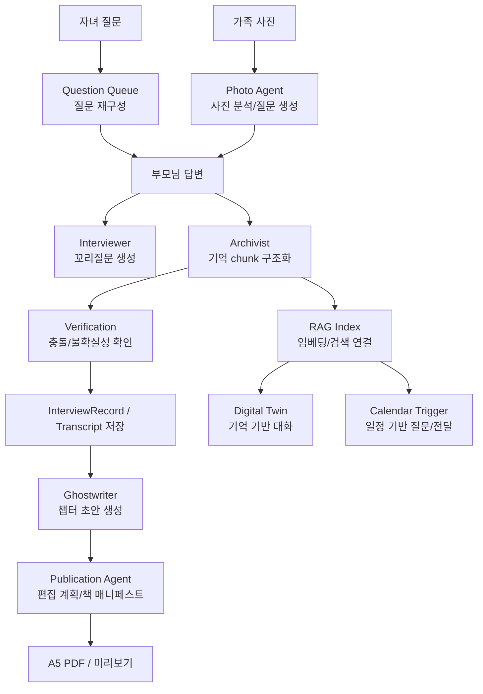
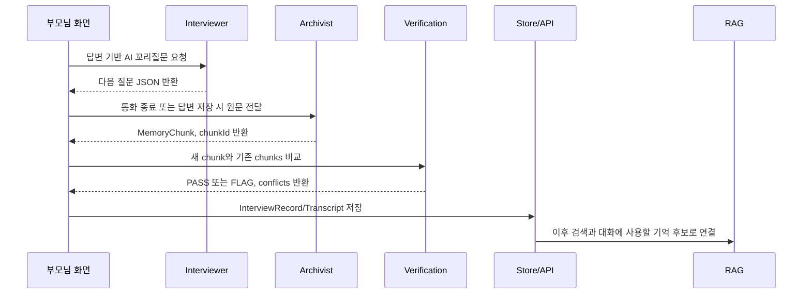
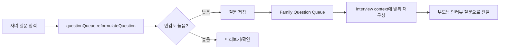
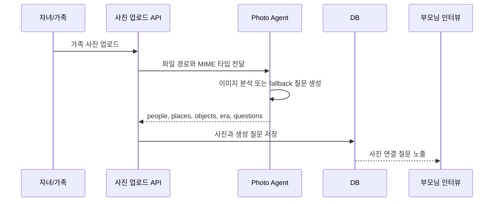
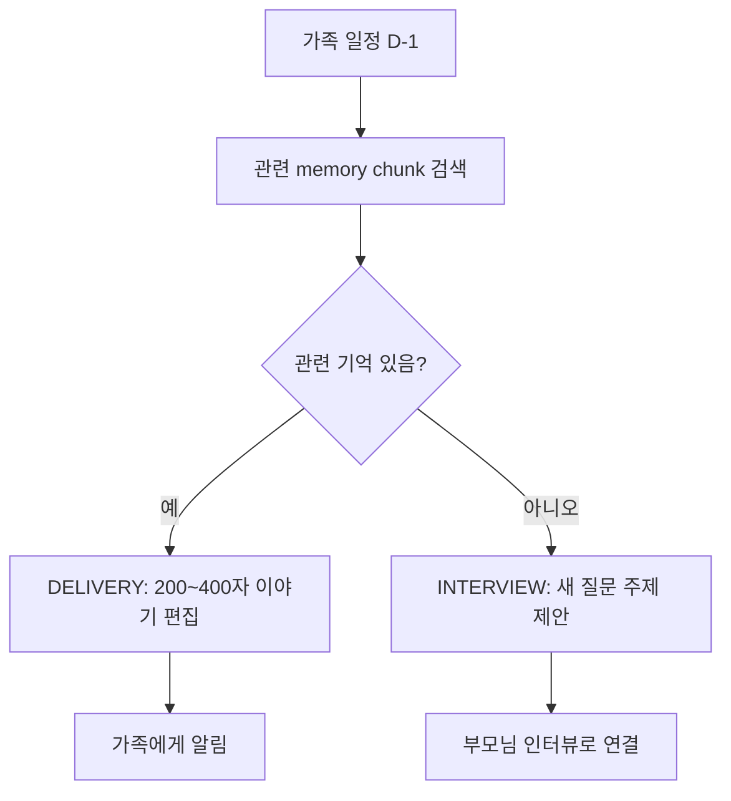
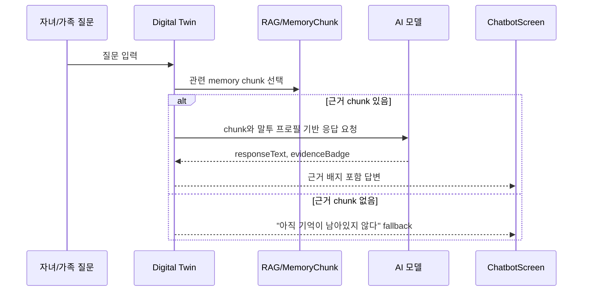
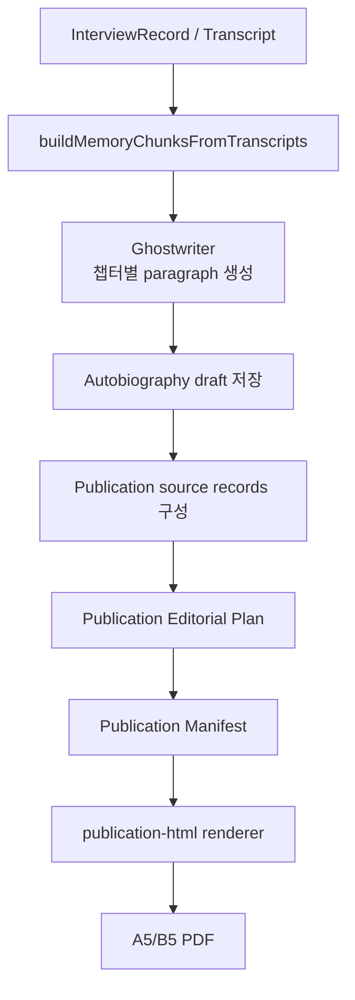
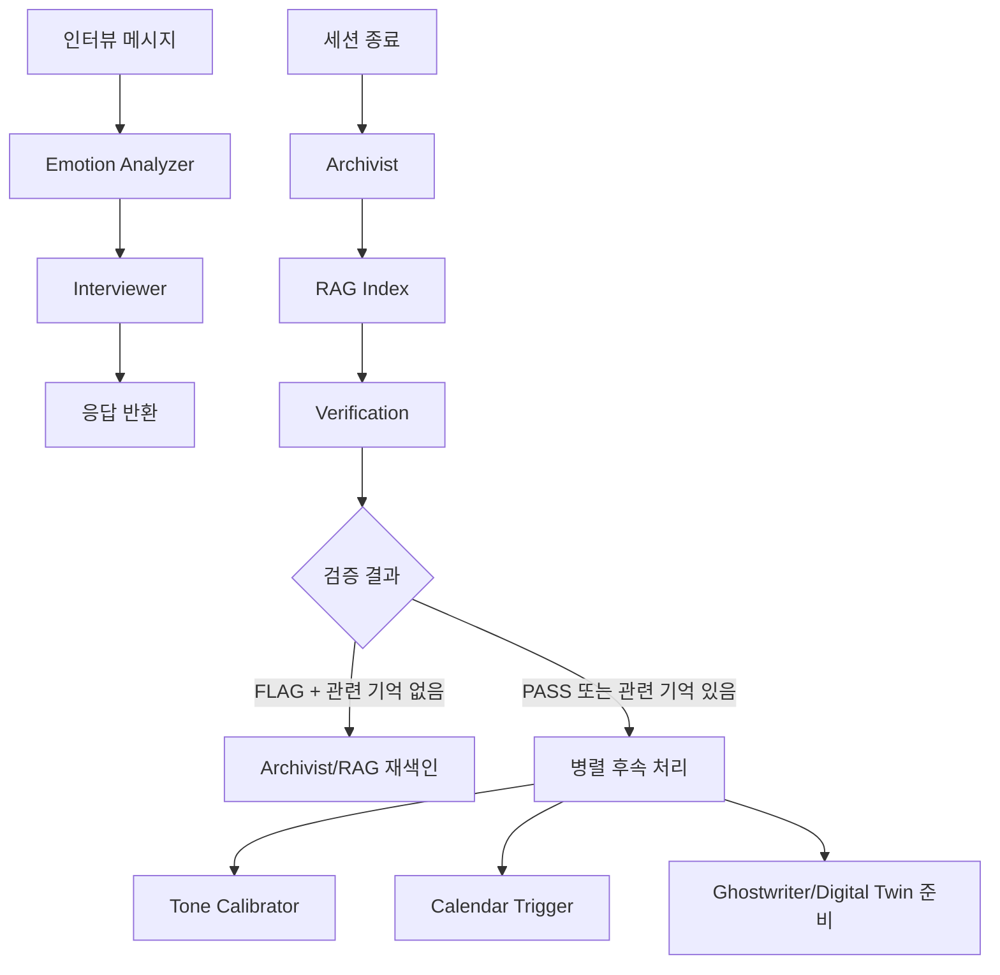

# Dearlog 에이전트 워크플로우 정리

작성일: 2026-06-06

## 1. 문서 목적

이 문서는 Dearlog 서비스에서 에이전트를 어떻게 사용했는지 한눈에 볼 수 있도록 정리한 신규 문서다. 기존 기술 설명서를 수정하지 않고, 현재 코드 기준으로 에이전트의 역할, 호출 위치, 데이터 흐름, 산출물을 워크플로우 중심으로 설명한다.

Dearlog의 에이전트는 하나의 범용 챗봇이 아니라, 가족 기록 서비스의 각 단계에 맞춰 분리된 전문 역할로 구성되어 있다. 부모님의 답변을 기록으로 구조화하고, 자녀 질문을 시니어 친화적으로 바꾸고, 사진과 일정을 인터뷰 질문으로 전환하며, 저장된 기억을 근거로 대화와 자서전 산출물을 만든다.

## 2. 전체 구조



## 3. 에이전트 레이어

### 3.1 프론트/앱 에이전트

주요 위치: `src/lib/agents/*`

| 에이전트 | 주요 파일 | 역할 | 대표 호출 화면 |
| --- | --- | --- | --- |
| Interviewer | `src/lib/agents/interviewer.ts` | 부모님 답변을 보고 자연스러운 꼬리질문 1개 생성 | `src/pages/ParentInterviewScreen.tsx` |
| Archivist | `src/lib/agents/archivist.ts` | 원문 답변을 `MemoryChunk`로 구조화하고 NER/감정/신뢰도 태깅 | `src/pages/ParentInterviewScreen.tsx` |
| Verification | `src/lib/agents/verification.ts` | 새 기억과 기존 기억의 충돌, 중복, 불확실성 확인 | `src/pages/ParentInterviewScreen.tsx` |
| Question Queue | `src/lib/agents/questionQueue.ts`, `src/lib/agents/family-question-queue.ts` | 자녀 질문을 시니어 친화적 질문으로 바꾸고 인터뷰 흐름에 주입 | `src/pages/ChildQuestionsScreen.tsx`, `src/pages/InterviewPage.tsx` |
| Photo Recall | `src/lib/agents/photo-recall.ts` | 사진 저장, 사진 설명 분석, 사진 기반 질문 생성 | `src/pages/InterviewPage.tsx` |
| Calendar Trigger | `src/lib/agents/calendarTrigger.ts`, `src/lib/agents/calendar-trigger.ts` | 가족 일정과 기억을 연결해 질문 또는 전달용 이야기 생성 | `src/pages/CalendarScreen.tsx`, `src/hooks/useScheduledCall.ts`, `src/pages/SettingsPage.tsx` |
| Digital Twin | `src/lib/agents/digitalTwin.ts`, `src/lib/agents/persona.ts` | 저장된 기억 chunk만 근거로 부모님 말투의 답변 생성 | `src/pages/ChatbotScreen.tsx`, `src/pages/PersonaPage.tsx` |
| Ghostwriter | `src/lib/agents/ghostwriter.ts` | 저장된 답변을 챕터별 자서전 초안으로 변환 | `src/pages/AutobiographyScreen.tsx`, `src/pages/ParentProgressScreen.tsx` |
| Tone Calibrator | `src/lib/agents/tone-calibrator.ts` | 답변 말투 패턴을 분석하고 생성 문장에 반영 | Agent router, Persona |
| Emotion Analyzer | `src/lib/agents/emotion-analyzer.ts` | 인터뷰 메시지의 감정 상태 분류 | `src/lib/agents/router.ts` |

### 3.2 서버 에이전트

주요 위치: `server/domain/*-agent.ts`

| 에이전트 | 주요 파일 | 역할 | 대표 API 흐름 |
| --- | --- | --- | --- |
| Photo Agent | `server/domain/photo-agent.ts` | 업로드된 사진을 vision 모델로 분석하고 인터뷰 질문 생성 | `server/app.ts`의 사진 업로드 흐름 |
| Cover Agent | `server/domain/cover-agent.ts` | 인터뷰 기록 분위기를 분석해 표지 팔레트, 템플릿, 폰트 추천 | `/api/cover-designs/generate` |
| Publication Agent | `server/domain/publication-agent.ts` | 유료 PDF 수준의 편집 계획과 책 매니페스트 생성 | `server/publication.ts` |

### 3.3 AI 클라이언트/모델 라우팅

| 레이어 | 파일 | 역할 |
| --- | --- | --- |
| 프론트 로컬 AI 프록시 | `src/lib/openai-client.ts` | 브라우저에서 직접 API 키를 쓰지 않고 `/api/ai/*` 형태의 로컬 서버 프록시로 chat/embedding 요청 |
| 서버 AI 클라이언트 | `server/ai-clients.ts` | FactChat Gateway와 OpenAI 클라이언트 분리, `chat`, `vision`, `writing` 목적별 모델 라우팅 |
| RAG 인덱스 | `src/lib/rag/index.ts` | `text-embedding-3-small` 임베딩 생성, cosine similarity 기반 top-K 검색 |
| Graph RAG | `src/lib/rag/graph-rag.ts` | 인물/장소 관계 그래프를 만들어 persona 응답에 관계 맥락 추가 |

## 4. 워크플로우 1: 부모님 인터뷰 답변 저장

부모님 화면에서 질문에 답하면 답변 원문은 단순 저장만 되는 것이 아니라, 구조화와 검증 과정을 거쳐 이후 자서전, 대화방, 일정 트리거에서 재사용 가능한 기억 단위가 된다.



실제 호출 흐름은 `ParentInterviewScreen`의 완료 화면에서 `archiveTranscript -> verifyChunk -> addTranscript` 순서로 실행된다. `archiveTranscript`는 원문을 보존하면서 `raw`, `clean`, `tags`, `reliabilityLabel`, `chapterHint`를 만들고, `verifyChunk`는 최근 기존 chunk와 비교해 시간/인물/사실 충돌 또는 중복 여부를 표시한다.

중요한 설계 포인트는 에이전트가 기억을 임의로 확정하지 않는다는 점이다. Archivist는 원문을 직접 수정하지 않고 최소 정리만 수행하며, Verification은 충돌을 표시할 뿐 내용을 고치지 않는다. 실패 시에도 원문 기반 fallback chunk를 만들어 저장 흐름이 끊기지 않도록 되어 있다.

## 5. 워크플로우 2: 자녀 질문 등록과 인터뷰 주입

자녀가 질문을 등록하면 질문이 그대로 부모님께 전달되지 않는다. Question Queue 계열 에이전트가 질문을 시니어가 편안하게 답할 수 있는 회상형 질문으로 바꾼다.



`src/pages/ChildQuestionsScreen.tsx`는 `reformulateQuestion`을 호출한다. 이 에이전트는 직접적이거나 부담스러운 질문을 경험 중심 표현으로 바꾸고, `sensitivityLevel`을 반환한다. 예를 들어 판단을 묻는 질문은 “그 일을 시작하게 된 계기가 있으셨나요?”처럼 회상형 질문으로 바뀐다.

`family-question-queue.ts`는 등록된 가족 질문을 우선순위와 생성 순서에 따라 고르고, 인터뷰 맥락에 맞는 자연스러운 전환 문구로 재작성한다. 익명 질문은 질문자의 정체가 드러나지 않도록 별도 규칙을 둔다.

## 6. 워크플로우 3: 사진 기반 회상 질문

사진은 단순 첨부 자료가 아니라, 부모님 기억을 끌어내는 시각 단서로 사용된다.



서버의 `photo-agent.ts`는 이미지 파일을 base64 data URL로 만들어 vision 목적의 chat completion에 전달한다. 응답은 `people`, `places`, `objects`, `estimatedEra`, `description`, `questions` 구조로 정규화된다. API 키가 없거나 이미지가 아닌 경우에도 사진을 보며 답할 수 있는 기본 질문 3개를 제공한다.

앱 내부의 `photo-recall.ts`는 클라이언트 측 사진 저장, 분석, 질문 생성, 기억과 사진 연결 기능을 담당한다. 즉 서버 Photo Agent는 실제 업로드 API 흐름을, 프론트 Photo Recall은 인터뷰/데모 흐름의 사진 기반 기억 연결을 담당한다.

## 7. 워크플로우 4: 일정 기반 질문 또는 이야기 전달

Calendar Trigger는 가족 일정이 다가올 때 이미 관련 기억이 있는지 확인하고, 있으면 전달용 이야기를 만들고 없으면 새 인터뷰 주제를 제안한다.



현재 모바일 화면에서는 `CalendarScreen`과 `useScheduledCall`이 `src/lib/agents/calendarTrigger.ts`의 `processCalendarTrigger`를 사용한다. 이 함수는 일정 유형별 키워드와 관련 인물을 기준으로 memory chunk를 찾고, 관련 chunk가 없으면 인터뷰 주제를 반환한다. 관련 chunk가 있으면 해당 chunk만 근거로 전달용 이야기를 생성한다.

`src/lib/agents/calendar-trigger.ts`는 RAG 검색 기반의 더 확장된 캘린더 트리거 구현이다. `SettingsPage`와 agent router 계열에서 사용되며, 일정 제목/유형/관련 인물/설명을 RAG query로 만들어 관련 기억 여부를 판단한다.

## 8. 워크플로우 5: 기억 기반 대화방

대화방은 자유 생성 챗봇이 아니라 저장된 기억 chunk가 있을 때만 답변하는 Digital Twin 흐름이다.



`src/pages/ChatbotScreen.tsx`는 `digitalTwin.ts`의 `generatePersonaResponse`를 호출한다. 이 버전은 화면에서 이미 구성된 `MemoryChunk[]`를 입력으로 받아 신뢰도 `UNVERIFIED`가 아닌 최근 chunk를 기반으로 답한다.

`src/lib/agents/persona.ts`는 더 확장된 persona 에이전트다. 질문을 사실확인형, 시기회상형, 가치관탐색형, 인물관련형으로 분류하고, `ragIndex.search`로 top-5 기억을 찾은 뒤, 접근 권한과 챗봇 동의가 있는 기억만 사용한다. 또한 인물/장소 관계 그래프를 결합한 hybrid RAG context를 만들어 답변 근거를 강화한다.

두 구현 모두 공통적으로 “chunk 없는 창작 금지”를 핵심 제약으로 둔다. 관련 기억이 없으면 답을 지어내지 않고 fallback 응답을 반환한다.

## 9. 워크플로우 6: 자서전 초안과 출판용 PDF

자서전 흐름은 두 단계로 나뉜다. 앱에서는 챕터 초안을 만들고, 서버에서는 출판용 편집 계획과 책 매니페스트를 생성한다.



`src/lib/agents/ghostwriter.ts`는 서버에서 내려온 답변을 `MemoryChunk` 형태로 변환한 뒤, 챕터별 관련 chunk만 골라 문단을 만든다. 문체는 이야기책, 뉴스 기사, 인터뷰 형태로 분기되며, 각 문단은 `sourceChunkIds`를 포함해야 한다. 모델 호출 실패 시에는 원문 기반 fallback 문단을 생성한다.

서버의 `publication-agent.ts`는 상용 품질의 기록책을 위해 더 엄격한 규칙을 둔다. 먼저 `buildPublicationEditorialPlan`이 어떤 챕터가 강한지, 어떤 부분이 약한지, 어떤 사진과 기억을 연결할지, 추가 질문이 필요한지 판단한다. 이후 `buildPublicationManifest`가 표지, 챕터, 문단, 사진 배치, 닫는 글, 디자인 플랜을 포함한 책 매니페스트를 만든다.

중요한 검증 규칙은 다음과 같다.

- 모든 본문 문단은 실제 `sourceRecords[].id`를 최소 1개 이상 가져야 한다.
- 출처 텍스트와 충분히 맞지 않는 AI 문단은 제외된다.
- 내부 검증 용어, QA 용어, `CONFIRMED`, `UNVERIFIED`, `sourceRecords` 같은 메타데이터는 독자용 문장에 노출하지 않는다.
- 자료가 부족하면 내용을 지어내지 않고 `missingSections` 또는 follow-up question으로 남긴다.
- AI 응답이 없거나 timeout이 발생하면 source record 기반 fallback manifest를 만든다.

## 10. Agent Router의 역할

`src/lib/agents/router.ts`는 여러 에이전트를 하나의 파이프라인으로 묶는 오케스트레이터다. 현재 새 모바일 화면이 모든 기능을 이 router만 통해 호출하지는 않지만, Dearlog가 의도한 에이전트 구조를 가장 잘 보여주는 파일이다.



router의 핵심 설계는 에러 회복력이다. 개별 에이전트가 실패해도 전체 저장 흐름을 멈추지 않고, fallback 또는 skip 상태로 계속 진행한다. `AgentError[]`에 어떤 에이전트가 실패했는지 남기는 방식으로 디버깅 가능성을 확보한다.

## 11. 데이터 경계와 안전장치

Dearlog의 에이전트 설계는 “따뜻한 생성”보다 “근거 있는 기록”을 우선한다.

| 안전장치 | 적용 위치 | 설명 |
| --- | --- | --- |
| 원문 보존 | Archivist | `raw` 필드는 원문을 보존하고 `clean`만 최소 정리 |
| JSON 출력 계약 | 대부분의 LLM 에이전트 | 후속 저장/검증이 가능하도록 구조화된 JSON만 요구 |
| chunk 없는 창작 금지 | Digital Twin, Persona, Calendar, Ghostwriter, Publication | 근거 기억이 없으면 fallback 또는 추가 질문으로 처리 |
| 출처 ID 강제 | Ghostwriter, Publication Agent | 문단마다 실제 chunk/source record ID 필요 |
| 권한/동의 필터 | Persona | 챗봇 동의와 접근 권한이 있는 기억만 사용 |
| 모델 실패 fallback | Archivist, Verification, Photo, Cover, Ghostwriter, Publication | AI 호출 실패 시 원문/규칙 기반 결과로 서비스 지속 |
| 목적별 모델 라우팅 | server/ai-clients.ts | 일반 chat, vision, writing 요청을 분리해 FactChat/OpenAI를 사용 |

## 12. 사용된 주요 파일 맵

```text
src/lib/agents/
  router.ts                    # 에이전트 파이프라인 오케스트레이터
  interviewer.ts               # 꼬리질문 생성
  archivist.ts                 # 답변 구조화/태깅
  verification.ts              # 기억 충돌 확인
  questionQueue.ts             # 자녀 질문 재구성
  family-question-queue.ts     # 질문 큐, 우선순위, 인터뷰 주입
  photo-recall.ts              # 앱 내부 사진 기반 회상
  calendarTrigger.ts           # 현재 모바일 일정 트리거
  calendar-trigger.ts          # RAG 기반 확장 일정 트리거
  digitalTwin.ts               # 현재 대화방용 기억 기반 응답
  persona.ts                   # RAG/Graph RAG 기반 확장 persona
  ghostwriter.ts               # 자서전 챕터 초안
  tone-calibrator.ts           # 말투 분석/적용
  emotion-analyzer.ts          # 감정 상태 분류

src/lib/rag/
  index.ts                     # 임베딩 생성과 top-K 검색
  graph-rag.ts                 # 인물/장소 관계 그래프 기반 context
  cosine.ts                    # 유사도 계산

server/domain/
  photo-agent.ts               # 서버 사진 분석/질문 생성
  cover-agent.ts               # 표지 디자인 추천
  publication-agent.ts         # 편집 계획/책 매니페스트 생성

server/
  ai-clients.ts                # FactChat/OpenAI 모델 라우팅
  publication.ts               # publication agent 호출과 PDF 입력 구성
  app.ts                       # 사진, 표지, 출판 API 진입점
```

## 13. 요약

Dearlog는 에이전트를 “AI가 대화하는 기능”으로만 쓰지 않고, 가족 기록 생산 공정의 각 단계에 배치했다.

1. 부모님 답변은 Archivist와 Verification을 거쳐 근거 있는 기억 chunk가 된다.
2. 자녀 질문과 사진은 부모님이 편하게 답할 수 있는 인터뷰 질문으로 바뀐다.
3. 기억 chunk는 RAG와 Graph RAG로 연결되어 대화방의 근거가 된다.
4. 일정은 기억이 있으면 이야기 전달로, 없으면 새 인터뷰 질문으로 이어진다.
5. 자서전은 Ghostwriter 초안과 Publication Agent의 편집 계획/매니페스트를 통해 PDF 산출물로 완성된다.

결과적으로 Dearlog의 에이전트 워크플로우는 “수집 → 구조화 → 검증 → 검색 연결 → 대화/책 산출”의 흐름으로 구성되어 있으며, 각 단계는 원문 보존과 출처 기반 생성을 중심 원칙으로 삼고 있다.
