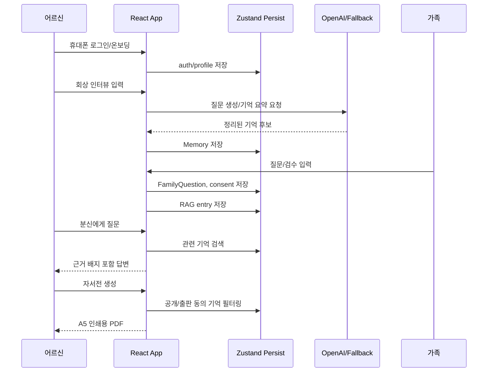

# Dearlog 기술 설명서

## 1. 시스템 개요

Dearlog는 어르신의 회상 인터뷰를 기억 카드로 정리하고, 가족 질문, 사진 메타데이터, 근거 기반 분신 대화, 인쇄용 자서전으로 확장하는 모바일 우선 웹 앱이다.

```mermaid
flowchart LR
  "어르신" --> "로그인/온보딩"
  "로그인/온보딩" --> "회상 인터뷰"
  "회상 인터뷰" --> "기억 카드"
  "사진 업로드" --> "사진 분석/메타데이터"
  "기억 카드" --> "추억 보관함"
  "사진 분석/메타데이터" --> "추억 보관함"
  "가족" --> "가족 질문/검수"
  "추억 보관함" --> "RAG 검색 연결"
  "RAG 검색 연결" --> "나의 분신 대화"
  "기억 카드" --> "자서전 생성"
  "자서전 생성" --> "A5 인쇄용 PDF"
```

## 2. 프론트엔드 구조

| 영역 | 주요 파일 | 역할 |
| --- | --- | --- |
| 앱 라우팅 | `src/App.tsx`, `src/routes/pageLoaders.ts` | 인증/온보딩 공개 라우트와 메인 앱 라우트 분리 |
| 레이아웃/여정 | `src/components/Layout.tsx`, `src/components/JourneyRail.tsx`, `src/lib/journey/user-journey.ts` | 로그인 이후 서비스 여정 상태와 CTA 표시 |
| 상태 관리 | `src/store.ts` | Zustand persist 기반 기억, 사진, 질문, 자서전, 인증, 데모 상태 저장 |
| 회상 기록 | `src/pages/InterviewPage.tsx`, `src/lib/agents/interviewer.ts` | 대화형 인터뷰, 사진 회상, 기억 카드 생성 |
| 추억 보관함 | `src/pages/ArchivePage.tsx`, `src/lib/tags/tag-db.ts` | 태그 DB, 사진 메타데이터, 민감정보 마스킹 |
| 가족 검수 | `src/pages/ReviewPage.tsx`, `src/lib/agents/family-question-queue.ts` | 가족 질문 등록, 공개 범위/동의 검토 |
| 분신 대화 | `src/pages/PersonaPage.tsx`, `src/lib/agents/persona.ts`, `src/lib/rag/index.ts` | 저장된 기억 기반 답변과 근거 배지 |
| 자서전 | `src/pages/AutobiographyPage.tsx`, `src/lib/agents/ghostwriter.ts`, `src/lib/pdf/generator.ts` | 자서전 문체 선택, 미리보기, A5 PDF 생성 |
| 발표 데모 | `src/lib/demo/*`, `scripts/generate-capstone-assets.ts` | 사전 DB, 오프라인 시연, PDF/화면 산출물 생성 |

## 3. 데이터 흐름



## 4. RAG/분신 대화 흐름

```mermaid
flowchart TD
  "기억 카드 생성" --> "RAG entry 생성"
  "RAG entry 생성" --> "memoryId, text, embedding 저장"
  "사용자 질문" --> "질문 유형 분류"
  "질문 유형 분류" --> "관련 기억 검색"
  "관련 기억 검색" --> "근거 있는 답변 생성"
  "근거 있는 답변 생성" --> "evidenceBadge 표시"
  "관련 기억 없음" --> "기록된 기억이 없다고 응답"
```

캡스톤 발표 모드에서는 `demo.offlineMode`가 켜져 있을 때 외부 API 호출 없이 `createDemoPersonaResponse`가 사전 기억에서 답변을 만든다. 네트워크 실패가 발표를 막지 않도록 만든 안전장치다.

## 5. 자서전/PDF 생성 흐름

```mermaid
flowchart LR
  "공개 가능한 기억" --> "문체 선택"
  "문체 선택" --> "챕터 생성"
  "챕터 생성" --> "가족 검수 코멘트"
  "가족 검수 코멘트" --> "PDF-ready 구조"
  "PDF-ready 구조" --> "일반 PDF"
  "PDF-ready 구조" --> "A5 인쇄용 PDF"
  "사진 데이터" --> "A5 인쇄용 PDF"
```

인쇄용 PDF는 `jsPDF`를 사용하며 `public/fonts/NotoSansKR-Regular.ttf`를 등록해 한글 렌더링을 지원한다. 발표 산출물은 `npm run demo:assets`로 생성한다.

## 6. 개인정보/동의 설계

| 항목 | 구현 방식 |
| --- | --- |
| 기억 공개 범위 | `private`, `family`, `public` 수준으로 저장 |
| 목적별 동의 | 출판, 가족열람, 챗봇, 사후공개, 민감정보 동의 상태 관리 |
| 가족 공개 전 검수 | `ReviewPage`에서 공개 버전 편집과 공개 범위 변경 |
| 사진 GPS | 앱 화면, 태그, PDF에서 원본 좌표 대신 `공개 전 확인 필요`로 표시 |
| 사후 이용 정책 | 전체 공개, 현재 설정 유지, 전체 삭제 정책 선택 |
| 발표 데모 데이터 | `demo_` prefix로 분리해 초기화 가능 |

## 7. 구현 완료 vs 프로토타입 가정

| 구분 | 구현 완료 | 프로토타입/향후 작업 |
| --- | --- | --- |
| 인증 | 휴대폰 번호/6자리 코드 기반 프론트엔드 흐름 | 실제 SMS 발송, 서버 세션, 계정 복구 |
| 온보딩 | 어르신/가족 역할 선택, 어르신 프로필 | 가족 초대 링크, 다중 가족 권한 |
| 기억 기록 | 대화형 인터뷰, 사진 회상, 기억 카드 저장 | 실제 장기 서버 저장, 음성 STT 고도화 |
| 사진 | EXIF 일부 파싱, 메타데이터 표시, GPS 마스킹 | HEIC/PNG 메타데이터, 역지오코딩 |
| 분신 대화 | RAG 구조, 근거 배지, 오프라인 데모 응답 | 운영용 벡터 DB, 장기 대화 기억 |
| 자서전 | 문체 선택, 챕터 미리보기, A5 PDF | 인쇄 주문/배송, 편집 템플릿 다양화 |
| 개인정보 | 동의 설정, 공개 범위, 사후 정책, 민감정보 마스킹 | 암호화, 접근 로그, 법무 검토 |
| 발표 산출물 | PDF, 화면 SVG, 발표 대본, Q&A | 실제 사용자 인터뷰 기반 데이터셋 |

## 8. 테스트 전략

| 테스트 종류 | 예시 |
| --- | --- |
| 라우팅/인증 | 미인증 접근 리다이렉트, 온보딩 미완료 처리 |
| 사용자 흐름 | 가족 질문, 공개 범위 변경, 자서전 생성 |
| 속성 기반 테스트 | 인터뷰, 태그, RAG, 동의, 말투 분석 로직 |
| 회귀 테스트 | GPS 마스킹, 데모 데이터 중복 주입 방지 |
| 산출물 생성 | `npm run demo:assets`로 PDF/화면 패키지 생성 |

현재 검증 명령:

```bash
npm run lint
npm test
npm run build
```
