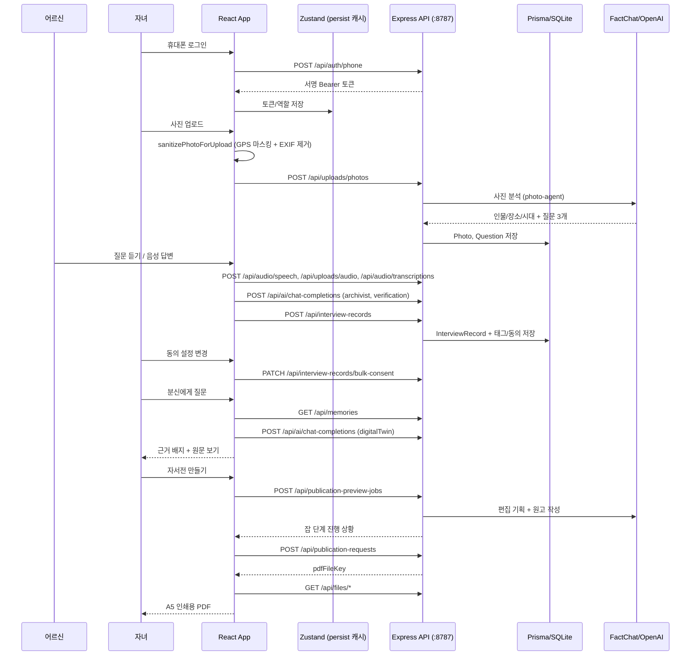

# Dearlog 기술 설명서

이 문서의 모든 파일 경로·라우트·엔드포인트는 현재 코드에서 직접 확인한 것이다. 아직 화면에 배선되지 않은 기능은 8·9절에 프로토타입으로 분리해 적었다.

## 1. 시스템 개요

Dearlog는 부모님의 회상 인터뷰를 서버에 저장하고, 자녀의 사진·질문, 가족 일정 트리거, 근거 기반 분신 대화, 인쇄용 자서전으로 확장하는 모바일 전용 가족 기억 아카이브 서비스다. 프론트는 React 19 + Vite + Zustand, 백엔드는 Express + Prisma/SQLite이고 저장소는 서버다.

```mermaid
flowchart LR
  "어르신" --> "로그인/초대 자동 로그인"
  "로그인/초대 자동 로그인" --> "챕터/질문 목록"
  "챕터/질문 목록" --> "인터뷰 (TTS·녹음·STT)"
  "인터뷰 (TTS·녹음·STT)" --> "AI 정리 + 충돌 검증"
  "AI 정리 + 충돌 검증" --> "서버 저장 (InterviewRecord)"
  "자녀" --> "사진 업로드"
  "사진 업로드" --> "GPS 마스킹/EXIF 제거"
  "GPS 마스킹/EXIF 제거" --> "서버 사진 분석"
  "서버 사진 분석" --> "추천 질문"
  "추천 질문" --> "가족 질문 등록"
  "가족 질문 등록" --> "챕터/질문 목록"
  "서버 저장 (InterviewRecord)" --> "동의 설정 (출판/챗봇)"
  "동의 설정 (출판/챗봇)" --> "나의 분신 대화"
  "동의 설정 (출판/챗봇)" --> "자서전 초안"
  "가족 일정" --> "캘린더 트리거"
  "캘린더 트리거" --> "이야기 전달 또는 인터뷰 주제"
  "자서전 초안" --> "출판 미리보기 잡"
  "출판 미리보기 잡" --> "A5 인쇄용 PDF"
```

## 2. 프론트엔드 구조

라우팅 진입점은 `src/main.tsx` → `src/App.tsx`다. 모든 화면은 `React.lazy`로 나뉘고 `ErrorBoundary` + `Suspense`로 감싸인다. 공통 셸은 `mx-auto min-h-[100dvh] max-w-[390px] bg-[#F8F6F9]`다.

| 영역 | 주요 파일 | 역할 |
| --- | --- | --- |
| 앱 셸/라우팅 | `src/App.tsx` | 라우트 정의, `RoleGuard` 역할 가드, `ScheduledCallMonitor`, Capacitor `dearlog:` 딥링크 |
| 상태 | `src/store/authStore.ts`, `interviewStore.ts`, `childStore.ts`, `autobiographyStore.ts`, `calendarStore.ts`, `consentStore.ts`, `scheduledCallStore.ts`, `devModeStore.ts` | Zustand 스토어 8개. `persist`로 localStorage 캐시를 두고 `src/lib/local-server.ts`로 서버와 동기화 |
| 서버 통신 | `src/lib/local-server.ts` | 단일 API 클라이언트(약 1,100줄). Bearer 토큰 부착, 파일 업로드/다운로드, 모든 도메인 호출 |
| 인증/온보딩 | `src/pages/SplashScreen.tsx`, `IntroScreen.tsx`, `AuthScreen.tsx`, `VerifyPage.tsx`, `AutoLoginScreen.tsx`, `ParentWelcomeScreen.tsx`, `SelectModeScreen.tsx` | 휴대폰 인증, 초대 토큰 자동 로그인, 역할 선택 |
| 부모님 화면 | `src/pages/ParentHomeScreen.tsx`, `ParentInterviewScreen.tsx`, `ParentProgressScreen.tsx`, `ParentTranscriptScreen.tsx`, `src/components/BottomNav.tsx` | 질문 낭독, 녹음, STT, AI 정리, 원문/정리본 비교 |
| 자녀 화면 | `src/pages/ChildHomeScreen.tsx`, `ChildQuestionsScreen.tsx`, `ChildPhotosScreen.tsx`, `ChildProgressScreen.tsx`, `ChildChaptersScreen.tsx`, `CreateRecordSpaceScreen.tsx`, `src/components/ChildBottomNav.tsx` | 질문 등록/재구성, 사진 업로드와 GPS 마스킹, 진행률, 기록 공간 생성과 초대 |
| 분신 대화 | `src/pages/ChatbotScreen.tsx`, `src/lib/agents/digitalTwin.ts` | 기억 chunk 선택, 근거 배지, `원문 보기` 토글 |
| 자서전/출판 | `src/pages/AutobiographyScreen.tsx`, `PublicationPreviewScreen.tsx`, `src/components/PublicationBookPreview.tsx`, `src/lib/agents/ghostwriter.ts` | 문체 3종 선택, 챕터 초안 생성, 미리보기 잡 폴링, A5 PDF 내려받기, 검수 리포트 |
| 동의/설정 | `src/pages/ConsentSettingsScreen.tsx`, `MyPageScreen.tsx` | 답변별 출판/챗봇 동의, 초대 링크 관리, AI 프록시 운영 점검 패널 |
| 일정/호출 | `src/pages/CalendarScreen.tsx`, `src/hooks/useScheduledCall.ts`, `src/lib/agents/calendarTrigger.ts` | 가족 일정 등록, 기념일 트리거, 예약 시간 인터뷰 호출. `useScheduledCall`은 1분 간격으로 검사해 예약 시각이면 `/parent/interview?type=scheduled`로 이동하고, D-1 일정은 `processCalendarTrigger` 결과를 `window.alert`로 알린다(정식 알림 UI는 미구현) |
| 다중 어르신 컨텍스트 | `src/hooks/useActiveSeniorContext.ts`, `src/components/ActiveSeniorContextBar.tsx` | 자녀가 여러 부모님 기록 공간을 전환 |
| 발표 데모 | `src/pages/DemoSettingsScreen.tsx`, `src/lib/demo/demo-seed-adapter.ts`, `src/lib/demo/capstone-demo-data.ts` | 데모 시드 주입/초기화, 오프라인 모드, 시연 6단계 안내 |

라우트 목록은 `README.md`의 `화면과 라우트` 표를 참고한다(`src/App.tsx`와 1:1로 맞춰 두었다).

## 3. 데이터 흐름

저장소는 Express + Prisma/SQLite 서버다. Zustand `persist`는 오프라인 캐시와 발표 데모 주입용이며 원본 데이터의 소유자가 아니다. 프론트의 AI 호출은 모두 서버 프록시를 거치므로 브라우저 번들에는 API 키가 없다.



## 4. 서버 구조

`server/app.ts`에 `/api/*` 69개, `/twilio/*` 3개, 빌드된 프론트를 돌려주는 catch-all 1개가 등록돼 있다. Prisma 모델은 24개다.

| 파일 | 역할 |
| --- | --- |
| `server/index.ts`, `server/app.ts` | 서버 부트스트랩과 전체 라우트 등록 |
| `server/auth.ts` | 서명 Bearer 토큰 발급/검증, `requireRole`, 개발 헤더 차단 |
| `server/config.ts` | 환경변수 로딩(FactChat, OpenAI, Twilio, VAPID, AI 프록시 임계값, 토큰/파일 TTL) |
| `server/db.ts`, `server/prisma/schema.prisma`, `server/prisma/init.ts`, `server/prisma/seed.ts` | Prisma 클라이언트, 스키마 24모델, 마이그레이션/시드 |
| `server/ai-clients.ts` | FactChat Gateway(OpenAI 호환) 및 OpenAI 클라이언트, 모델 이름 정규화(gpt-5/claude 분기) |
| `server/ai-usage.ts` | 사용량 추정, `AiProxyAuditLog` 기록, 내부 AI 호출 텔레메트리 |
| `server/domain/constants.ts` | 고정 챕터 7개, 공통 질문 30개, `MIN_ANSWERS_PER_CHAPTER = 15`, 표지 팔레트/템플릿/서체 |
| `server/domain/photo-agent.ts` | 사진 분석 및 회상 질문 3개 생성. 키가 없으면 로컬 fallback |
| `server/domain/cover-agent.ts` | 표지 팔레트/템플릿/서체 결정과 후보 3안 생성 |
| `server/domain/publication-agent.ts` | 출판 편집 기획, 판매 준비도, 품질 체크리스트, 매니페스트 타입 |
| `server/domain/free-speech.ts` | 질문과 무관한 자유 발화 판별 |
| `server/publication.ts` | 미리보기 잡 상태기계, 초안 캐시, 재시도, 인쇄물 생성 |
| `server/publication-html.ts` | A5/B5 조판 HTML 생성과 `puppeteer-core` PDF 렌더 |
| `server/storage.ts` | 사진/음성/PDF 로컬 저장과 파일 키 |
| `server/push.ts`, `server/phone.ts`, `server/app-call.ts`, `server/realtime-bridge.ts`, `server/worker.ts` | Web Push, 전화번호 정규화, 앱 내 호출, 실시간 브리지, 백그라운드 워커 |

라우트 묶음과 권한 경계는 `README.md`의 `서버 구조` 표와 `docs/route-authorization-matrix.md`를 참고한다.

### 출판 파이프라인

```mermaid
flowchart LR
  "동의된 InterviewRecord" --> "cache_check"
  "cache_check" --> "editorial_plan"
  "editorial_plan" --> "writing_draft"
  "writing_draft" --> "manifest"
  "manifest" --> "render"
  "render" --> "done"
  "cache_check" --> "PublicationDraftCache 재사용"
  "PublicationDraftCache 재사용" --> "manifest"
  "editorial_plan" --> "판매 준비도 + 품질 체크리스트"
  "render" --> "A5/B5 PDF (puppeteer-core)"
```

- 잡 상태는 `queued`, `running`, `ready`, `failed`이고 단계는 `cache_check`, `editorial_plan`, `writing_draft`, `manifest`, `render`, `done`이다.
- 원본 기록 해시로 초안 캐시(`PublicationDraftCache`)를 재사용하고, 회복 가능한 오류는 지연 후 재시도한다.
- 판매 준비도는 `ready_for_paid_book`, `needs_family_review`, `needs_more_records` 세 값이며 `/child/autobiography/preview`, `/parent/autobiography/preview`에서 체크리스트와 함께 보여준다.
- 인쇄용 PDF는 서버에서 만든다. 한글 렌더는 `public/fonts/NotoSansKR-Regular.ttf`를 조판 HTML의 `@font-face`로 심어 처리한다. 사용되지 않던 클라이언트 PDF 컴포넌트와 `jspdf`·`@react-pdf/renderer` 의존성은 제거해 PDF 생성 경로를 서버로 일원화했다.
- 실제 결제·주문·배송 추적은 인쇄 제휴 연동 단계로 남아 있다.

## 5. AI 에이전트

프론트 에이전트는 `src/lib/agents/config.ts`의 `isDemoMode()`(= `devModeStore.isDemoMode`)를 먼저 확인한 뒤, `src/lib/openai-client.ts`를 통해 서버 프록시 `/api/ai/chat-completions`를 호출한다. `openai-client.ts`는 브라우저 OpenAI SDK가 아니라 `local-server.ts` 호출을 감싼 얇은 shim이다.

| 파일 | 함수 | 동작 | 실패 시 |
| --- | --- | --- | --- |
| `interviewer.ts` | `generateFollowUpQuestion` | 인물·장소·감정·사건·시간 우선순위로 꼬리질문 1개 생성 | 예외 던짐 |
| `archivist.ts` | `archiveTranscript` | `raw` 원문 보존, `clean` 정리, NER 4종(persons/places/times/events), 감정 8종 0~1 점수, 신뢰도 라벨 | 원문 그대로의 chunk 반환 |
| `verification.ts` | `verifyChunk` | 최근 chunk 10개와 비교해 `TIME/PERSON/FACT_CONFLICT`, `DUPLICATE` 플래그만 부착 | `PASS` 반환 |
| `ghostwriter.ts` | `buildMemoryChunksFromTranscripts`, `getToneInstruction`, `generateChapterDraft` | 문체 프로필별 지시문으로 챕터 초안 생성, 문단마다 `sourceChunkIds`·`reliability` 유지, `missingSections` 표기 | 기록 원문 기반 초안 |
| `digitalTwin.ts` | `buildMemoryChunksFromMemories`, `selectRelevantMemoryChunks`, `generatePersonaResponse` | 6절 참고 | 근거 기반 fallback 또는 "기록에 없다" 응답 |
| `questionQueue.ts` | `reformulateQuestion` | 직접→간접, 사실확인→회상, 민감→우회로 질문 재작성, 민감도 라벨 | 원본 질문 그대로 |
| `calendarTrigger.ts` | `processCalendarTrigger` | 일정 유형 키워드/관련 인물로 chunk를 찾아 `DELIVERY`(편집된 이야기) 또는 `INTERVIEW`(주제 제안) 분기 | `INTERVIEW` 주제 제안 |

서버 측 에이전트(`photo-agent`, `cover-agent`, `publication-agent`)는 FactChat 키가 없거나 호출이 실패하면 모두 로컬 fallback 결과를 반환하고 `AiProxyAuditLog`에 `fallback`으로 기록한다.

## 6. 분신 대화 흐름

신세대 분신 대화는 벡터 DB나 임베딩 검색이 아니라 **한국어 토큰 점수 기반 chunk 선택**이다. `MemoryVectorEntry` 테이블과 `/api/ai/embeddings`는 존재하지만 분신 대화 경로에서 사용하지 않는다.

```mermaid
flowchart TD
  "GET /api/memories" --> "buildMemoryChunksFromMemories"
  "buildMemoryChunksFromMemories" --> "챗봇 동의 revoked 제외"
  "챗봇 동의 revoked 제외" --> "raw/clean/NER/감정/신뢰도 chunk"
  "사용자 질문" --> "토큰화 + 조사 제거 + 불용어 제거"
  "토큰화 + 조사 제거 + 불용어 제거" --> "도메인 키워드 확장"
  "raw/clean/NER/감정/신뢰도 chunk" --> "UNVERIFIED chunk 제외"
  "UNVERIFIED chunk 제외" --> "chunk 점수 계산 (정확 일치 3, 부분 일치 2)"
  "도메인 키워드 확장" --> "chunk 점수 계산 (정확 일치 3, 부분 일치 2)"
  "chunk 점수 계산 (정확 일치 3, 부분 일치 2)" --> "상위 5개 선택"
  "상위 5개 선택" --> "프록시 chat completion"
  "프록시 chat completion" --> "evidenceBadge 정규화"
  "evidenceBadge 정규화" --> "원문 보기 + 신뢰도 표시"
  "상위 5개 선택" --> "응답 비면 원문 인용 fallback"
  "UNVERIFIED chunk 제외" --> "남은 chunk 0개"
  "남은 chunk 0개" --> "기록에 없다고 응답 (fallbackTriggered)"
```

구현 세부:

- `buildMemoryChunksFromMemories`가 챗봇 동의가 `revoked`인 기억과 동의 철회 기억을 걸러낸 뒤 `raw`/`clean`/NER/감정 점수/신뢰도 라벨 chunk로 바꾼다.
- `selectRelevantMemoryChunks`는 질문을 토큰화하고 한국어 조사(`은/는/이/가/을/를/에서/에게`…)를 떼고 불용어를 제거한 다음, 도메인 키워드(취미, 음식, 학교, 직장, 결혼 등)로 확장해 chunk 텍스트와 매칭한다. 정확 토큰 일치 3점, 부분 문자열 일치 2점으로 점수를 매겨 상위 5개를 고르고, 매칭이 하나도 없으면 원래 순서대로 앞 5개를 쓴다.
- 신뢰도 `UNVERIFIED` chunk는 후보에서 제외한다. 남는 chunk가 없으면 "그건 내가 남겨둔 이야기에는 없어…"라는 고정 응답과 `fallbackTriggered: true`를 반환한다.
- 응답은 `normalizeDigitalTwinResult`에서 `usedChunkIds` 중복 제거, 질문 유형 검증(`fact`/`recall`/`value`/`person`), 기본 신뢰도 보정을 거친다. `usedChunkIds`가 비고 `fallbackTriggered`면 응답 문구를 "기록에 없다"로 강제한다.
- 프록시 응답이 비었거나 예외가 나면 `buildGroundedFallbackResponse`가 첫 chunk의 원문 300자를 그대로 인용해 답한다. 즉 AI가 죽어도 창작하지 않는다.
- `ChatbotScreen`은 `evidenceBadge.usedChunkIds` 수를 "저장된 이야기 N개"로 보여주고 `원문 보기`를 눌러 원문과 신뢰도 라벨을 확인시킨다.
- 발표 데모 모드에서는 `isDemoMode()`가 참이라 프록시를 호출하지 않고 사전 응답을 반환한다.

## 7. 기록 범위

인터뷰 질문은 서버 `FIXED_CHAPTERS` 7개와 공통 질문 30개를 기준으로 구성된다. 챕터별 목표 답변 수는 15개다.

| 챕터 ID | 서버 제목 | 앱 표기 (`src/store/interviewStore.ts`) |
| --- | --- | --- |
| `childhood` | 유년기 | 어린 시절 |
| `adolescence` | 청소년기 | 학창 시절 |
| `youth` | 청년기 | 청년 시절 |
| `family_home` | 가정을 꾸린 이야기 | 결혼과 가족 |
| `hobbies` | 취미 | 일과 삶 |
| `relationships` | 인간관계 | 사람과 관계 |
| `messages` | 전하고 싶은 이야기 | 자녀에게 남기는 말 |

여기에 자녀가 등록한 가족 질문과 사진에서 생성된 질문이 챕터에 붙고, 질문과 무관한 답변은 `server/domain/free-speech.ts`의 판별로 자유 발화 기록으로 분리된다.

## 8. 개인정보/동의 설계

| 항목 | 구현 방식 | 상태 |
| --- | --- | --- |
| 답변별 동의 | 앱은 답변(`InterviewRecord`)마다 출판/챗봇 두 토글을 제공하고 전체·챕터·개별 일괄 적용을 지원한다. `PATCH /api/interview-records/:id`, `PATCH /api/interview-records/bulk-consent` | 구현 완료 |
| 목적별 동의 5종 | 서버 `MemoryConsentSettings`가 `publish`, `familyRead`, `chatbot`, `posthumous`, `sensitive`를 저장한다 | 서버만. 앱 화면은 출판/챗봇 2종만 노출 |
| 챗봇 근거 필터 | `buildMemoryChunksFromMemories`가 챗봇 동의 철회 기억을 chunk 단계에서 제외 | 구현 완료 |
| 사진 GPS | `src/pages/ChildPhotosScreen.tsx`가 업로드 직전 `sanitizePhotoForUpload`를 호출한다. `maskSensitivePhotoMetadata`로 좌표를 `null`로 지우고 `gpsMasked`/`locationLabel`을 붙이며, `stripJpegExifSegments`로 JPEG의 APP1 `Exif` 세그먼트를 잘라낸 새 `File`을 업로드한다. 서버로 보내는 위치 텍스트는 `buildMaskedLocationText`가 `공개 전 확인 필요`를 붙이고, 사진 카드에는 `위치 정보 공개 전 확인 필요` 배지를 띄운다 | 구현 완료(라이브 업로드 경로에 배선됨) |
| AI 왜곡 방지 | 원문(`raw`)은 수정하지 않고 보존한다. 분신 답변은 `evidenceBadge`와 `원문 보기`, 자서전 문단은 `sourceChunkIds`·`reliability`로 출처를 남긴다. `verifyChunk`는 충돌에 플래그만 달고 내용을 고치지 않는다 | 구현 완료 |
| 원문/정리본 비교 | `/parent/transcript`에서 `원문`과 `정리본`을 토글로 확인하고 수정 요청 상태를 표시한다 | 구현 완료 |
| 파일 접근 통제 | `GET /api/files/*`가 사진·음성·출판 PDF의 DB 소유권을 확인하고, 사진 URL에는 기본 10분 만료 서명 토큰을 붙인다 | 구현 완료 |
| AI 프록시 감사 | `AiProxyAuditLog`에 사용량·오류·차단을 남기고 마이페이지 운영 점검 패널에서 요약·임계값·알림을 확인한다 | 구현 완료 |
| 기억 단위 완전 삭제 | `DELETE /api/memories/:id`는 있으나 호출하는 화면이 없다. 화면에서 삭제 가능한 것은 사진과 가족 질문 | 미배선 |
| 사후 이용 정책 | `LegacyVault` 모델과 `/api/legacy/*` 6개(금고 등록, 조회, 사망 신고, 승인, 조각 조회, 초기화)가 동작하고 `posthumous` 동의 필드도 저장된다. 그러나 이를 호출하는 신세대 화면이 없고, 클라이언트 암호화·분할 모듈(`src/lib/security/encryption.ts`, `src/lib/security/shamir.ts`)은 단위 테스트만 있고 어떤 화면·API 호출에도 연결되지 않았다. 공개 정책도 시뮬레이션이다 | 프로토타입, UI 미배선 |
| 발표 데모 데이터 | `demo_` prefix 식별자로 분리하고 `/settings`에서 초기화 가능 | 구현 완료 |

## 9. 구현 완료 vs 프로토타입 가정

| 구분 | 구현 완료 | 프로토타입/향후 작업 |
| --- | --- | --- |
| 인증 | 휴대폰 번호 로그인, 서버 서명 Bearer 토큰, 초대 링크 발급/재발급/폐기와 만료, 부모님 자동 로그인 | 실제 SMS 발송, 토큰 갱신/폐기 저장소, 계정 복구 |
| 온보딩 | 역할 선택, 자녀 기록 공간 생성, 부모님 최소 프로필 | 카카오톡/전화형 참여, 다중 가족 권한 세분화 |
| 기억 기록 | 질문 낭독(TTS), 녹음, 서버 STT, AI 정리, 충돌 플래그, 서버 저장 | 화자 분리, 장시간 세션 안정화, STT 품질 고도화 |
| 사진 | 파일명·EXIF 촬영일 추론, 서버 사진 분석 기반 질문 생성, GPS 마스킹, JPEG EXIF 제거 | HEIC/PNG 메타데이터, 역지오코딩, 인물 태깅 |
| 분신 대화 | 동의 필터, 토큰 점수 chunk 선택, 근거 배지, 원문 보기, 오프라인 데모 응답 | 임베딩/벡터 검색 도입, 장기 대화 기억, 실제 음성 파일 재생 연결 |
| 자서전 | 문체 3종 선택, 챕터 초안, 문단별 출처, 서버 출판 잡, 표지 시안, A5 PDF, 검수 리포트 | 인쇄 주문/배송, 편집 템플릿 다양화, 렌더 지연 최적화 |
| 개인정보 | 답변별 출판/챗봇 동의, 파일 소유권 확인과 서명 URL, GPS 마스킹, AI 프록시 감사 | 기억 단위 완전 삭제 UI, 동의 5종 UI, 저장 데이터 암호화, 접근 로그, 법무 검토 |
| 재방문 루프 | 가족 질문, 캘린더 트리거, 인터뷰 예약과 앱 내 호출, 알림 저장 | 주간 가족 퀴즈(현재 구현 없음), Web Push 실제 운영 |
| 디지털 유산 | 서버 API와 모델, 사후 공개 상태 전환 | 신세대 UI, 키 관리, 기관 조각 위탁 운영, 법무·감사 검토 |
| 발표 데모 | 데모 시드 주입/초기화, 오프라인 모드, 시연 6단계 안내 화면 | 산출물 자동 생성 스크립트 재작성, 실제 사용자 데이터셋 |

## 10. 테스트 전략

| 테스트 종류 | 예시 파일 |
| --- | --- |
| 라우팅/인증 | `src/App.test.tsx`, `src/auth-onboarding.test.tsx` |
| 사용자 흐름 | `src/user-flows.integration.test.tsx` |
| 화면 단위 | `src/pages/ChildPhotosScreen.test.tsx`(GPS 마스킹), `ChatbotScreen.test.tsx`, `AutobiographyScreen.test.tsx`, `PublicationPreviewScreen.test.tsx`, `DemoSettingsScreen.test.tsx` |
| 에이전트 | `src/lib/agents/digitalTwin.test.ts`, `calendarTrigger.test.ts`, `ghostwriter*.test.ts`, `verification*.test.ts` |
| 속성 기반 테스트 | `src/lib/agents/*.property.test.ts` (fast-check) |
| 보안 유틸 | `src/lib/security/encryption.test.ts`, `src/lib/security/shamir.test.ts` |
| 서버 API | `server/app.test.ts`, `server/legacy-api.test.ts`, `server/ai-clients.test.ts` |

검증 명령:

```bash
npm run lint     # tsc --noEmit
npm test         # vitest --run
npm run build    # vite build
```

`vitest.config.ts`에 아직 제외 목록이 남아 있어 실행되는 파일/케이스 수가 변한다. 수치는 문서에서 인용하지 말고 실행 출력으로 확인한다. 최근 측정값은 `docs/current-work-status.md`에 측정 시점과 함께 기록한다.
