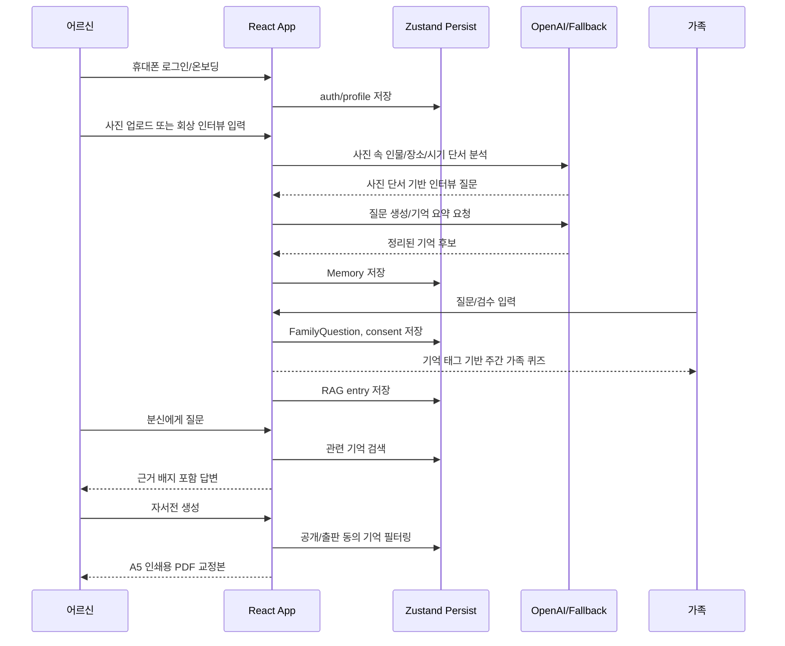

# Dearlog 기술 설명서

## 1. 시스템 개요

Dearlog는 부모님의 회상 인터뷰를 기억 카드로 정리하고, 가족 질문, 사진 기반 시각 단서 질문, 주간 가족 퀴즈, 기념일 알림, 근거 기반 분신 대화, 인쇄용 자서전으로 확장하는 모바일 우선 가족 기억 아카이브 서비스다.

```mermaid
flowchart LR
  "어르신" --> "로그인/온보딩"
  "로그인/온보딩" --> "기록 범위 선택/안내"
  "기록 범위 선택/안내" --> "회상 인터뷰"
  "회상 인터뷰" --> "기억 카드"
  "사진 업로드" --> "사진 분석/시각 단서"
  "사진 분석/시각 단서" --> "AI 회상 질문"
  "AI 회상 질문" --> "회상 인터뷰"
  "기억 카드" --> "추억 보관함"
  "사진 분석/시각 단서" --> "추억 보관함"
  "가족" --> "가족 질문/검수"
  "기억 카드" --> "주간 가족 퀴즈"
  "주간 가족 퀴즈" --> "가족 질문/검수"
  "가족 일정" --> "기념일 알림"
  "기념일 알림" --> "가족 질문/검수"
  "추억 보관함" --> "RAG 검색 연결"
  "RAG 검색 연결" --> "나의 분신 대화"
  "기억 카드" --> "자서전 생성"
  "자서전 생성" --> "A5 인쇄용 PDF 교정본"
```

## 2. 프론트엔드 구조

| 영역 | 주요 파일 | 역할 |
| --- | --- | --- |
| 앱 라우팅 | `src/App.tsx`, `src/routes/pageLoaders.ts` | 인증/온보딩 공개 라우트와 메인 앱 라우트 분리 |
| 레이아웃/여정 | `src/components/Layout.tsx`, `src/components/JourneyRail.tsx`, `src/lib/journey/user-journey.ts` | 로그인 이후 서비스 여정 상태와 CTA 표시 |
| 상태 관리 | `src/store.ts` | Zustand persist 기반 기억, 사진, 질문, 자서전, 인증, 데모 상태 저장 |
| 회상 기록 | `src/pages/InterviewPage.tsx`, `src/lib/agents/interviewer.ts`, `src/lib/agents/photo-recall.ts` | 대화형 인터뷰, 사진 단서 기반 질문, 기억 카드 생성 |
| 추억 보관함 | `src/pages/ArchivePage.tsx`, `src/lib/tags/tag-db.ts` | 태그 DB, 사진 메타데이터, 민감정보 마스킹 |
| 가족 검수/퀴즈 | `src/pages/ReviewPage.tsx`, `src/lib/agents/family-question-queue.ts`, `src/lib/insights/memory-insights.ts` | 가족 질문 등록, 주간 가족 퀴즈, 재방문 루프, 공개 범위/동의 검토 |
| 분신 대화 | `src/pages/PersonaPage.tsx`, `src/lib/agents/persona.ts`, `src/lib/rag/index.ts` | 저장된 기억 기반 답변, 근거 배지, STT 원문 확인 |
| 자서전 | `src/pages/AutobiographyPage.tsx`, `src/components/ChapterPreview.tsx`, `src/lib/agents/ghostwriter.ts`, `src/lib/pdf/generator.ts` | 자서전 문체 선택, 문장별 출처 확인, 미리보기, A5 PDF 생성 |
| 발표 데모 | `src/lib/demo/*`, `scripts/generate-capstone-assets.ts` | 사전 DB, 오프라인 시연, PDF/화면 산출물 생성 |

## 3. 데이터 흐름



## 4. RAG/분신 대화 흐름

```mermaid
flowchart TD
  "기억 카드 생성" --> "RAG entry 생성"
  "RAG entry 생성" --> "memoryId, text, embedding 저장"
  "사용자 질문" --> "질문 유형 분류"
  "질문 유형 분류" --> "관련 기억 검색"
  "관련 기억 검색" --> "근거 있는 답변 생성"
  "근거 있는 답변 생성" --> "evidenceBadge 표시"
  "evidenceBadge 표시" --> "STT 원문/음성 조각 확인"
  "관련 기억 없음" --> "기록된 기억이 없다고 응답"
```

캡스톤 발표 모드에서는 `demo.offlineMode`가 켜져 있을 때 외부 API 호출 없이 `createDemoPersonaResponse`가 사전 기억에서 답변을 만든다. 네트워크 실패가 발표를 막지 않도록 만든 안전장치다.

## 5. 기록 범위

Dearlog의 인터뷰는 “가족의 모든 기억”을 무한정 묻는 구조가 아니라, 자서전과 가족 대화로 전환하기 좋은 여섯 범위를 기준으로 질문을 구성한다.

| 범위 | 수집하는 내용 |
| --- | --- |
| 어린시절과 학창시절 | 고향, 학교, 친구, 부모님과 처음 형성된 가치관 |
| 가족과 관계 | 부모, 형제, 배우자, 자녀, 손주와 함께한 장면 |
| 일과 생계 | 첫 월급, 직장, 장사, 살림, 생계를 책임진 시간 |
| 전환점과 감정 | 이사, 결혼, 실패, 상실, 극복처럼 삶의 방향이 바뀐 사건 |
| 가치관과 남길 말 | 가족에게 전하고 싶은 조언, 당부, 감사, 사과 |
| 사진 속 생활사 | 여행, 명절, 음식, 동네, 물건처럼 사진에서 시작되는 일상 기억 |

## 6. 자서전/PDF 생성 흐름

```mermaid
flowchart LR
  "공개 가능한 기억" --> "문체 선택"
  "문체 선택" --> "챕터 생성"
  "챕터 생성" --> "가족 검수 코멘트"
  "가족 검수 코멘트" --> "PDF-ready 구조"
  "PDF-ready 구조" --> "일반 PDF"
  "PDF-ready 구조" --> "A5 인쇄용 PDF 교정본"
  "A5 인쇄용 PDF 교정본" --> "실물 책 주문 준비"
  "사진 데이터" --> "A5 인쇄용 PDF 교정본"
```

인쇄용 PDF는 `jsPDF`를 사용하며 `public/fonts/NotoSansKR-Regular.ttf`를 등록해 한글 렌더링을 지원한다. 현재 프로토타입은 PDF 교정본과 책 사양 안내까지 제공하고, 실제 결제·주문·배송 추적은 인쇄 제휴 연동 단계로 남긴다. 발표 산출물은 `npm run demo:assets`로 생성한다.

## 7. 개인정보/동의 설계

| 항목 | 구현 방식 |
| --- | --- |
| 기억 공개 범위 | `private`, `family`, `public` 수준으로 저장 |
| 목적별 동의 | 출판, 가족열람, 챗봇, 사후공개, 민감정보 동의 상태 관리 |
| 가족 공개 전 검수 | `ReviewPage`에서 공개 버전 편집과 공개 범위 변경 |
| 사진 GPS | 앱 화면, 태그, PDF에서 원본 좌표 대신 `공개 전 확인 필요`로 표시 |
| AI 왜곡 방지 | 챗봇 근거 배지와 자서전 출처를 눌러 STT 원문, AI 정리본, 가족 검수본을 나란히 확인 |
| 데이터 주권 | 기억별 모든 활용 중지와 완전 삭제를 제공하고, 삭제 시 검색 연결·사진 연결·자서전 초안을 함께 정리 |
| 사후 이용 정책 | 전체 공개, 현재 설정 유지, 전체 삭제 정책 선택 |
| 발표 데모 데이터 | `demo_` prefix로 분리해 초기화 가능 |

## 8. 구현 완료 vs 프로토타입 가정

| 구분 | 구현 완료 | 프로토타입/향후 작업 |
| --- | --- | --- |
| 인증 | 휴대폰 번호/6자리 코드 기반 프론트엔드 흐름 | 실제 SMS 발송, 서버 세션, 계정 복구 |
| 온보딩 | 어르신/가족 역할 선택, 자녀 준비형 안내, 어르신 최소 프로필 | 가족 초대 링크, 카카오톡/전화형 참여, 다중 가족 권한 |
| 기억 기록 | 대화형 인터뷰, 사진 단서 기반 AI 질문, 기억 카드 저장 | 실제 장기 서버 저장, 음성 STT 고도화 |
| 사진 | EXIF 일부 파싱, 시각 단서 표시, 메타데이터 표시, GPS 마스킹 | HEIC/PNG 메타데이터, 역지오코딩 |
| 분신 대화 | RAG 구조, 근거 배지, STT 원문 확인, 오프라인 데모 응답 | 운영용 벡터 DB, 장기 대화 기억, 실제 음성 파일 연결 |
| 자서전 | 문체 선택, 문장별 출처 확인, 챕터 미리보기, A5 PDF 교정본, 책 사양 안내 | 인쇄 주문/배송, 편집 템플릿 다양화 |
| 개인정보 | 동의 설정, 공개 범위, 활용 중지, 기억 삭제, 사후 정책, 민감정보 마스킹 | 암호화, 접근 로그, 법무 검토 |
| 발표 산출물 | PDF, 화면 SVG, 발표 대본, Q&A | 실제 사용자 인터뷰 기반 데이터셋 |

## 9. 테스트 전략

| 테스트 종류 | 예시 |
| --- | --- |
| 라우팅/인증 | 미인증 접근 리다이렉트, 온보딩 미완료 처리 |
| 사용자 흐름 | 가족 질문, 공개 범위 변경, 자서전 생성 |
| 속성 기반 테스트 | 인터뷰, 태그, RAG, 동의, 말투 분석 로직 |
| 회귀 테스트 | GPS 마스킹, 데모 데이터 중복 주입 방지 |
| 산출물 생성 | `npm run demo:assets`로 PDF/화면 패키지 생성 |

현재 검증 명령:

```bash
npm run lint
npm test
npm run build
```
