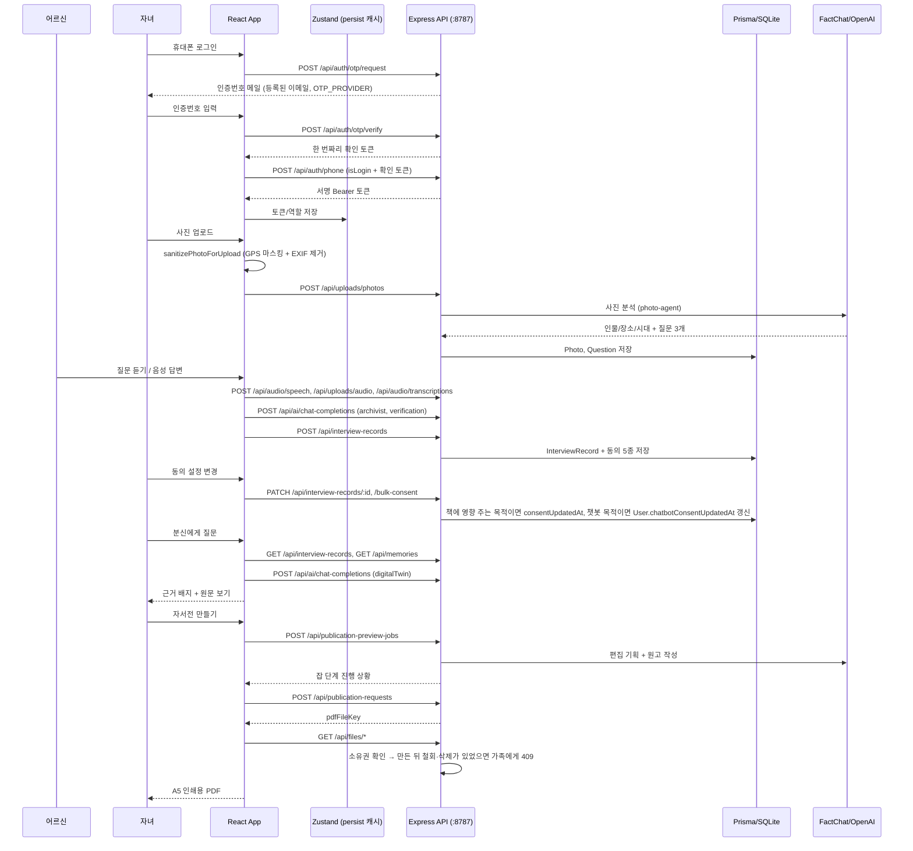

# Dearlog 기술 설명서

이 문서의 모든 파일 경로·라우트·엔드포인트는 현재 코드에서 직접 확인한 것이다. 마지막 대조: 2026-09-29(`9231464`). 아직 화면에 배선되지 않았거나 운영 전 단계인 기능은 8·9절에 따로 적었다.

## 1. 시스템 개요

Dearlog는 부모님의 회상 인터뷰를 서버에 저장하고, 자녀의 사진·질문, 가족 일정 트리거, 근거 기반 분신 대화, 인쇄용 자서전, 디지털 유산 금고로 확장하는 모바일 전용 가족 기억 아카이브 서비스다. 프론트는 React 19 + Vite + Zustand, 백엔드는 Express + Prisma/SQLite이고 저장소는 서버다.

```mermaid
flowchart LR
  "어르신" --> "로그인/초대 자동 로그인"
  "로그인/초대 자동 로그인" --> "챕터/질문 목록"
  "챕터/질문 목록" --> "인터뷰 (TTS·녹음·STT)"
  "인터뷰 (TTS·녹음·STT)" --> "AI 정리 + 충돌 검증"
  "AI 정리 + 충돌 검증" --> "서버 저장 (InterviewRecord)"
  "자녀" --> "사진 업로드"
  "사진 업로드" --> "GPS 마스킹/EXIF 제거"
  "GPS 마스킹/EXIF 제거" --> "서버 사진 분석"
  "서버 사진 분석" --> "추천 질문"
  "추천 질문" --> "가족 질문 등록"
  "가족 질문 등록" --> "챕터/질문 목록"
  "서버 저장 (InterviewRecord)" --> "동의 설정 (5종)"
  "동의 설정 (5종)" --> "나의 분신 대화"
  "동의 설정 (5종)" --> "자서전 초안"
  "동의 설정 (5종)" --> "유산 금고 (사후 공개)"
  "가족 일정" --> "캘린더 트리거"
  "캘린더 트리거" --> "이야기 전달 또는 인터뷰 주제"
  "자서전 초안" --> "출판 미리보기 잡"
  "출판 미리보기 잡" --> "A5 인쇄용 PDF"
```

## 2. 프론트엔드 구조

라우팅 진입점은 `src/main.tsx` → `src/App.tsx`다. 모든 화면은 `React.lazy`로 나뉘고 `ErrorBoundary` + `Suspense`로 감싸인다. 공통 셸은 `mx-auto min-h-[100dvh] max-w-[390px] bg-[#F8F6F9]`다.

| 영역 | 주요 파일 | 역할 |
| --- | --- | --- |
| 앱 셸/라우팅 | `src/App.tsx` | 라우트 정의, `RoleGuard`(역할 가드), `AuthGuard`(로그인만 확인), `ScheduledCallMonitor`, Capacitor `dearlog:` 딥링크(`DeepLinkListener`). `/settings`는 개발 모드이거나 `VITE_ENABLE_DEMO_SETTINGS=true` 빌드에서만 등록 |
| 상태 | `src/store/authStore.ts`, `interviewStore.ts`, `childStore.ts`, `autobiographyStore.ts`, `calendarStore.ts`, `consentStore.ts`, `scheduledCallStore.ts`, `devModeStore.ts` | Zustand 스토어 8개. `persist`로 localStorage 캐시를 두고 `src/lib/local-server.ts`로 서버와 동기화 |
| 서버 통신 | `src/lib/local-server.ts` | 단일 API 클라이언트(약 1,150줄). Bearer 토큰 부착, 파일 업로드/다운로드, Web Push 서비스워커 등록·구독, 모든 도메인 호출 |
| 챕터 정의 | `src/lib/chapters.ts` | 서버 `FIXED_CHAPTERS`를 그대로 가져다 쓰고 화면용 설명문만 덧붙인다. 화면 쪽에 따로 둔 챕터 목록은 없다 |
| 인증/온보딩 | `src/pages/SplashScreen.tsx`, `IntroScreen.tsx`, `AuthScreen.tsx`, `AutoLoginScreen.tsx`, `ParentWelcomeScreen.tsx` | 휴대폰 인증번호(OTP) 로그인/가입, 초대 토큰 자동 로그인, 부모님 최소 프로필 |
| 부모님 화면 | `src/pages/ParentHomeScreen.tsx`, `ParentInterviewScreen.tsx`, `ParentProgressScreen.tsx`, `ParentTranscriptScreen.tsx`, `src/components/BottomNav.tsx` | 질문 낭독, 녹음, STT, AI 정리, 원문/정리본 비교 |
| 자녀 화면 | `src/pages/ChildHomeScreen.tsx`, `ChildQuestionsScreen.tsx`, `ChildPhotosScreen.tsx`, `ChildProgressScreen.tsx`, `ChildChaptersScreen.tsx`, `CreateRecordSpaceScreen.tsx`, `src/components/ChildBottomNav.tsx` | 질문 등록/재구성, 사진 업로드와 GPS 마스킹, 진행률, 기록 공간 생성과 초대 |
| 분신 대화 | `src/pages/ChatbotScreen.tsx`, `src/lib/agents/digitalTwin.ts` | 기억 chunk 선택, 근거 배지, `원문 보기` 토글, 챗봇 동의 철회 시 지난 대화 삭제 |
| 자서전/출판 | `src/pages/AutobiographyScreen.tsx`, `PublicationPreviewScreen.tsx`, `src/components/PublicationBookPreview.tsx`, `src/lib/agents/ghostwriter.ts` | 문체 3종 선택, 챕터 초안 생성, 미리보기 잡 폴링, A5 PDF 내려받기, 검수 리포트 |
| 동의/설정 | `src/pages/ConsentSettingsScreen.tsx`, `MyPageScreen.tsx` | 답변별 동의 5종과 사진별 동의 4종, 답변별 활용 중지. 마이페이지는 초대 링크 관리, 푸시 알림 구독 토글과 알림함, 유산 금고 진입(역할별), AI 프록시 운영 점검 패널 |
| 디지털 유산 | `src/pages/LegacyVaultScreen.tsx`(`/parent/vault`), `src/pages/LegacyReviewScreen.tsx`(`/child/legacy`), `src/lib/security/shamir.ts`, `src/lib/security/encryption.ts` | 부모님: 금고 개설(기록 암호화 + 3-of-3 열쇠 분할), 가족 조각 표시·파일 저장, 해지, 사망 신고 취소. 보호자: 사망 신고·승인·취소, 전수 뒤 조각을 합쳐 기록 열기 |
| 일정/호출 | `src/pages/CalendarScreen.tsx`, `src/hooks/useScheduledCall.ts`, `src/lib/agents/calendarTrigger.ts` | 가족 일정 등록, 기념일 트리거, 예약 시간 인터뷰 호출. `useScheduledCall`은 1분 간격으로 검사해 예약 시각이면 `/parent/interview?type=scheduled`로 이동하고, D-1 일정은 `processCalendarTrigger` 결과를 `window.alert`로 알린다(정식 알림 UI는 미구현) |
| 다중 어르신 컨텍스트 | `src/hooks/useActiveSeniorContext.ts`, `src/components/ActiveSeniorContextBar.tsx` | 자녀가 여러 부모님 기록 공간을 전환 |
| 발표 데모 | `src/pages/DemoSettingsScreen.tsx`, `src/lib/demo/demo-seed-adapter.ts`, `src/lib/demo/capstone-demo-data.ts` | 데모 시드 주입/초기화, 오프라인 모드, 시연 6단계 안내 |

라우트 목록은 `README.md`의 `화면과 라우트` 표를 참고한다(`src/App.tsx`와 1:1로 맞춰 두었다).

## 3. 데이터 흐름

저장소는 Express + Prisma/SQLite 서버다. Zustand `persist`는 오프라인 캐시와 발표 데모 주입용이며 원본 데이터의 소유자가 아니다. 프론트의 AI 호출은 모두 서버 프록시를 거치므로 브라우저 번들에는 API 키가 없다.


```mermaid
sequenceDiagram
  participant Parent as 어르신
  participant Child as 자녀
  participant App as React App
  participant Store as Zustand (persist 캐시)
  participant API as Express API (:8787)
  participant DB as Prisma/SQLite
  participant AI as FactChat/OpenAI

  Child->>App: 휴대폰 로그인
  App->>API: POST /api/auth/otp/request
  API-->>Child: 인증번호 메일 (등록된 이메일, OTP_PROVIDER)
  Child->>App: 인증번호 입력
  App->>API: POST /api/auth/otp/verify
  API-->>App: 한 번짜리 확인 토큰
  App->>API: POST /api/auth/phone (isLogin + 확인 토큰)
  API-->>App: 서명 Bearer 토큰
  App->>Store: 토큰/역할 저장
  Child->>App: 사진 업로드
  App->>App: sanitizePhotoForUpload (GPS 마스킹 + EXIF 제거)
  App->>API: POST /api/uploads/photos
  API->>AI: 사진 분석 (photo-agent)
  AI-->>API: 인물/장소/시대 + 질문 3개
  API->>DB: Photo, Question 저장
  Parent->>App: 질문 듣기 / 음성 답변
  App->>API: POST /api/audio/speech, /api/uploads/audio, /api/audio/transcriptions
  App->>API: POST /api/ai/chat-completions (archivist, verification)
  App->>API: POST /api/interview-records
  API->>DB: InterviewRecord + 동의 5종 저장
  Child->>App: 동의 설정 변경
  App->>API: PATCH /api/interview-records/:id, /bulk-consent
  API->>DB: 책에 영향 주는 목적이면 consentUpdatedAt, 챗봇 목적이면 User.chatbotConsentUpdatedAt 갱신
  Child->>App: 분신에게 질문
  App->>API: GET /api/interview-records, GET /api/memories
  App->>API: POST /api/ai/chat-completions (digitalTwin)
  App-->>Child: 근거 배지 + 원문 보기
  Child->>App: 자서전 만들기
  App->>API: POST /api/publication-preview-jobs
  API->>AI: 편집 기획 + 원고 작성
  API-->>App: 잡 단계 진행 상황
  App->>API: POST /api/publication-requests
  API-->>App: pdfFileKey
  App->>API: GET /api/files/*
  API->>API: 소유권 확인 → 만든 뒤 철회·삭제가 있었으면 가족에게 409
  App-->>Child: A5 인쇄용 PDF
```

## 4. 서버 구조

`server/app.ts`에 `/api/*` 73개와 빌드된 프론트를 돌려주는 catch-all 1개가 등록돼 있다. 예전의 `/twilio/*` 전화 인터뷰 웹훅과 `/twilio/media` WebSocket은 앱 내 음성 인터뷰(`server/app-call.ts`)로 대체되면서 2026-07-31에 제거됐다. Prisma 모델은 24개다.

| 파일 | 역할 |
| --- | --- |
| `server/index.ts`, `server/app.ts` | 서버 부트스트랩과 전체 라우트 등록 |
| `server/auth.ts` | 서명 Bearer 토큰 발급/검증, `requireRole`, 개발 헤더 차단. `AUTH_TOKEN_SECRET`이 비면 로그인이 503으로 실패한다(대체 시크릿 없음) |
| `server/config.ts` | 환경변수 로딩(FactChat, OpenAI, VAPID, AI 프록시 임계값, 토큰/파일 TTL) |
| `server/db.ts`, `server/prisma/schema.prisma`, `server/prisma/init.ts`, `server/prisma/seed.ts` | Prisma 클라이언트, 스키마 24모델, 마이그레이션/시드 |
| `server/ai-clients.ts` | FactChat Gateway(OpenAI 호환) 및 OpenAI 클라이언트, 모델 이름 정규화(gpt-5/claude 분기). OpenAI 클라이언트는 embeddings·TTS·STT에 쓴다 |
| `server/ai-usage.ts` | 사용량 추정, `AiProxyAuditLog` 기록, 내부 AI 호출 텔레메트리 |
| `server/domain/constants.ts` | 고정 챕터 7개(`FIXED_CHAPTERS`, 챕터 제목의 유일한 출처), 공통 질문 30개, `MIN_ANSWERS_PER_CHAPTER = 15`, 표지 팔레트/템플릿/서체 |
| `server/domain/photo-agent.ts` | 사진 분석 및 회상 질문 3개 생성. 키가 없으면 로컬 fallback |
| `server/domain/cover-agent.ts` | 표지 팔레트/템플릿/서체 결정과 후보 3안 생성 |
| `server/domain/publication-agent.ts` | 출판 편집 기획, 판매 준비도, 품질 체크리스트, 매니페스트 타입 |
| `server/domain/free-speech.ts` | 질문과 무관한 자유 발화 판별 |
| `server/publication.ts` | 미리보기 잡 상태기계, 초안 캐시, 재시도, 인쇄물 생성 |
| `server/publication-html.ts` | A5/B5 조판 HTML 생성과 `puppeteer-core` PDF 렌더. Chrome은 프로세스당 한 번 띄워 재사용한다 |
| `server/storage.ts` | 사진/음성/PDF 로컬 저장, 파일 키, 업로드 크기·필드 제한(사진 20 MiB, 음성 25 MiB) |
| `server/otp-sender.ts`, `server/email-address.ts`, `server/phone-verification.ts` | 인증번호 발송(`gmail`은 Gmail SMTP, `dev`는 로그·파일, 설정이 없으면 발송하지 않음), 이메일 정규화·가리기, 인증번호·확인 토큰 보관(단일 인스턴스 메모리). 확인 토큰은 인증번호를 받은 주소를 함께 담는다 |
| `server/push.ts`, `server/app-call.ts`, `server/worker.ts` | Web Push 발송(VAPID 키가 없어도 `Notification` 행은 남김), 앱 내 인터뷰 호출, 백그라운드 워커 |

라우트 묶음과 권한 경계는 `README.md`의 `서버 구조` 표와 `docs/route-authorization-matrix.md`를 참고한다.

로그인과 가입은 휴대폰 인증을 거친다.

1. `POST /api/auth/otp/request`: 로그인이면 가입된 번호의 **등록된 이메일**로(요청에 적힌 주소는 무시, 이메일이 없으면 409), 가입이면 새 번호에 대해 입력한 이메일로 6자리 인증번호를 보낸다. 응답에는 가린 주소(`sentTo`)만 준다. 번호는 `crypto.randomInt`로 뽑고 해시만 보관한다. `OTP_PROVIDER`가 없으면 503, 발송이 실패하면 502이고 그 인증번호는 버린다. 다시 받기는 1분 간격, 발송은 번호별(기본 5회)·IP별(기본 50회)로 10분 창 안에서 제한한다.
2. `POST /api/auth/otp/verify`: 3분 안에, 인증번호마다 5번까지 맞혀 볼 수 있다. 맞히면 번호와 용도(login/signup)에 묶인 10분짜리 한 번짜리 확인 토큰을 준다.
3. `POST /api/auth/phone`: `isLogin`이 불리언이어야 하고 확인 토큰이 필요하다. 가입은 요청 본문이 아니라 토큰에 담긴, 인증번호를 실제로 받은 이메일을 저장한다. 로그인은 토큰을 확인한 뒤에야 이름 일치 여부를 알려 준다. 인증 없이 이름을 대입해 맞는지 볼 수 없게 하려는 것이다. 성공하면 토큰을 소비한다. 시도 횟수는 번호별(기본 10회)·IP별(기본 100회)로 제한한다.

인증번호와 토큰은 로그인 시도 제한처럼 서버 메모리에 있어서, 서버를 다시 켜면 진행 중이던 인증은 사라진다.

### 출판 파이프라인

```mermaid
flowchart LR
  "publish·sensitive 동의된 InterviewRecord/Photo" --> "cache_check"
  "cache_check" --> "editorial_plan"
  "editorial_plan" --> "writing_draft"
  "writing_draft" --> "manifest"
  "manifest" --> "render"
  "render" --> "done"
  "cache_check" --> "PublicationDraftCache 재사용"
  "PublicationDraftCache 재사용" --> "manifest"
  "editorial_plan" --> "판매 준비도 + 품질 체크리스트"
  "render" --> "A5/B5 PDF (puppeteer-core)"
```

- 출판 입력은 `publish`와 `sensitive`가 모두 동의된 기록과 사진만 쓴다(`server/publication.ts`).
- 잡 상태는 `queued`, `running`, `ready`, `failed`이고 단계는 `cache_check`, `editorial_plan`, `writing_draft`, `manifest`, `render`, `done`이다.
- 원본 기록 해시로 초안 캐시(`PublicationDraftCache`)를 재사용한다. 재시도 상한은 회복 가능한 오류 6회(`PUBLICATION_PREVIEW_MAX_RECOVERABLE_ATTEMPTS`), 그 밖의 오류 2회이고, 상한을 넘으면 잡은 `failed`로 끝난다. `POST /api/publication-requests`도 PDF 생성에 실패하면 요청을 `generating`에 남기지 않고 `failed`로 바꾼다.
- 판매 준비도는 `ready_for_paid_book`, `needs_family_review`, `needs_more_records` 세 값이며 `/child/autobiography/preview`, `/parent/autobiography/preview`에서 체크리스트와 함께 보여준다.
- 이미 만든 결과물의 소급 차단: `GET /api/files/*`(PDF)와 `GET /api/publication-preview-jobs/:id`는 소유권 확인 뒤 `hasPublicationConsentRevokedSince`를 본다. 결과물을 만든 뒤 `publish`/`sensitive`가 철회됐거나 책에 들어갈 수 있던 사진이 삭제됐으면 가족에게 409와 "다시 만들어 주세요"를 준다. 부모님 본인은 계속 볼 수 있다. 책에 영향을 주지 않는 목적(`chatbot`, `familyRead`, `posthumous`)의 변경은 책을 막지 않는다.
- 인쇄용 PDF는 서버에서 만든다. 한글 렌더는 `public/fonts/NotoSansKR-Regular.ttf`를 조판 HTML의 `@font-face`로 심어 처리한다. 클라이언트 PDF 엔진은 없다.
- Chrome은 `CHROME_PATH` → `PUPPETEER_EXECUTABLE_PATH` → 시스템 Chrome/Chromium(macOS `/Applications`, Linux `/usr/bin`) → Playwright가 받아 둔 Chromium(`PLAYWRIGHT_BROWSERS_PATH` 또는 `~/.cache/ms-playwright`의 `chromium-<리비전>`, 최신 리비전 우선) 순서로 찾는다.
- 실제 결제·주문·배송 추적은 인쇄 제휴 연동 단계로 남아 있다.

## 5. AI 에이전트

프론트 에이전트는 `src/lib/agents/config.ts`의 `isDemoMode()`(= `devModeStore.isDemoMode`)를 먼저 확인한 뒤, `src/lib/openai-client.ts`를 통해 서버 프록시 `/api/ai/chat-completions`를 호출한다. `openai-client.ts`는 브라우저 OpenAI SDK가 아니라 `local-server.ts` 호출을 감싼 얇은 shim이다.

| 파일 | 함수 | 동작 | 실패 시 |
| --- | --- | --- | --- |
| `interviewer.ts` | `generateFollowUpQuestion` | 인물·장소·감정·사건·시간 우선순위로 꼬리질문 1개 생성 | 예외 던짐 |
| `archivist.ts` | `archiveTranscript` | `raw` 원문 보존, `clean` 정리, NER 4종(persons/places/times/events), 감정 8종 0~1 점수, 신뢰도 라벨 | 원문 그대로의 chunk 반환 |
| `verification.ts` | `verifyChunk` | 최근 chunk 10개와 비교해 `TIME/PERSON/FACT_CONFLICT`, `DUPLICATE` 플래그만 부착 | `PASS` 반환 |
| `ghostwriter.ts` | `buildMemoryChunksFromTranscripts`, `getToneInstruction`, `generateChapterDraft` | 문체 프로필별 지시문으로 챕터 초안 생성, 문단마다 `sourceChunkIds`·`reliability` 유지, `missingSections` 표기. 자서전 화면은 `publish`·`sensitive` 동의 기록만 넘긴다 | 기록 원문 기반 초안 |
| `digitalTwin.ts` | `buildMemoryChunksFromMemories`, `selectRelevantMemoryChunks`, `generatePersonaResponse` | 6절 참고 | 근거 기반 fallback 또는 "기록에 없다" 응답 |
| `questionQueue.ts` | `reformulateQuestion` | 직접→간접, 사실확인→회상, 민감→우회로 질문 재작성, 민감도 라벨 | 원본 질문 그대로 |
| `calendarTrigger.ts` | `processCalendarTrigger` | 일정 유형 키워드/관련 인물로 chunk를 찾아 `DELIVERY`(편집된 이야기) 또는 `INTERVIEW`(주제 제안) 분기 | `INTERVIEW` 주제 제안 |

서버 측 에이전트(`photo-agent`, `cover-agent`, `publication-agent`)는 FactChat 키가 없거나 호출이 실패하면 모두 로컬 fallback 결과를 반환하고 `AiProxyAuditLog`에 `fallback`으로 기록한다. 표지 에이전트도 `publish`·`sensitive` 동의 기록만 입력으로 쓴다.

## 6. 분신 대화 흐름

분신 대화는 벡터 DB나 임베딩 검색이 아니라 **한국어 토큰 점수 기반 chunk 선택**이다. `MemoryVectorEntry` 테이블과 `/api/ai/embeddings`는 존재하지만 분신 대화 경로에서 사용하지 않는다.

chunk의 출처는 두 가지다. 실제 답변은 `InterviewRecord`(`GET /api/interview-records`)에서 오고, `Memory`(`GET /api/memories`)는 운영 코드에서 만들어지지 않아 데모 시드에서만 채워진다.

```mermaid
flowchart TD
  "GET /api/interview-records" --> "chatbot·sensitive 철회 기록 제외"
  "chatbot·sensitive 철회 기록 제외" --> "buildMemoryChunksFromTranscripts (UNVERIFIED → ESTIMATED)"
  "GET /api/memories" --> "buildMemoryChunksFromMemories (챗봇 동의 revoked 제외)"
  "buildMemoryChunksFromTranscripts (UNVERIFIED → ESTIMATED)" --> "mergeMemoryChunks"
  "buildMemoryChunksFromMemories (챗봇 동의 revoked 제외)" --> "mergeMemoryChunks"
  "사용자 질문" --> "토큰화 + 조사 제거 + 불용어 제거"
  "토큰화 + 조사 제거 + 불용어 제거" --> "도메인 키워드 확장"
  "mergeMemoryChunks" --> "UNVERIFIED chunk 제외"
  "UNVERIFIED chunk 제외" --> "chunk 점수 계산 (정확 일치 3, 부분 일치 2)"
  "도메인 키워드 확장" --> "chunk 점수 계산 (정확 일치 3, 부분 일치 2)"
  "chunk 점수 계산 (정확 일치 3, 부분 일치 2)" --> "상위 5개 선택"
  "상위 5개 선택" --> "프록시 chat completion"
  "프록시 chat completion" --> "evidenceBadge 정규화"
  "evidenceBadge 정규화" --> "원문 보기 + 신뢰도 표시"
  "상위 5개 선택" --> "응답 비면 원문 인용 fallback"
  "UNVERIFIED chunk 제외" --> "남은 chunk 0개"
  "남은 chunk 0개" --> "기록에 없다고 응답 (fallbackTriggered)"
```

구현 세부:

- `ChatbotScreen`은 답변 기록 중 `chatbot`이나 `sensitive`가 철회된 것을 빼고 `buildMemoryChunksFromTranscripts`로 chunk를 만든다. 이 경로의 chunk는 신뢰도 `UNVERIFIED`를 `ESTIMATED`로 올려 쓴다. 부모님이 직접 말한 원문이라 아래 `UNVERIFIED` 제외 단계에서 통째로 빠지지 않게 하기 위해서다.
- `buildMemoryChunksFromMemories`는 챗봇 동의가 `revoked`인 기억과 동의 철회 기억을 걸러낸 뒤 `raw`/`clean`/NER/감정 점수/신뢰도 라벨 chunk로 바꾼다. 두 출처는 `mergeMemoryChunks`로 합친다.
- `selectRelevantMemoryChunks`는 질문을 토큰화하고 한국어 조사(`은/는/이/가/을/를/에서/에게`…)를 떼고 불용어를 제거한 다음, 도메인 키워드(취미, 음식, 학교, 직장, 결혼 등)로 확장해 chunk 텍스트와 매칭한다. 정확 토큰 일치 3점, 부분 문자열 일치 2점으로 점수를 매겨 상위 5개를 고르고, 매칭이 하나도 없으면 원래 순서대로 앞 5개를 쓴다.
- 신뢰도 `UNVERIFIED` chunk는 후보에서 제외한다. 남는 chunk가 없으면 "그건 내가 남겨둔 이야기에는 없어…"라는 고정 응답과 `fallbackTriggered: true`를 반환한다.
- 응답은 `normalizeDigitalTwinResult`에서 `usedChunkIds` 중복 제거, 질문 유형 검증(`fact`/`recall`/`value`/`person`), 기본 신뢰도 보정을 거친다. `usedChunkIds`가 비고 `fallbackTriggered`면 응답 문구를 "기록에 없다"로 강제한다.
- 프록시 응답이 비었거나 예외가 나면 `buildGroundedFallbackResponse`가 첫 chunk의 원문 300자를 그대로 인용해 답한다. 즉 AI가 죽어도 창작하지 않는다.
- `ChatbotScreen`은 `evidenceBadge.usedChunkIds` 수를 "저장된 이야기 N개"로 보여주고 `원문 보기`를 눌러 원문과 신뢰도 라벨을 확인시킨다.
- 지난 대화는 브라우저 localStorage에 남는다. `GET /api/memories`가 내려주는 `User.chatbotConsentUpdatedAt`보다 앞선 세션은 localStorage에서 지운다. 목록은 이 시각을 받은 뒤에만 채운다. 통신에 실패하면 지우지 않고 다음 조회로 미룬다.
- 발표 데모 모드에서는 `isDemoMode()`가 참이라 프록시를 호출하지 않고 사전 응답을 반환한다.

## 7. 기록 범위

인터뷰 질문은 서버 `FIXED_CHAPTERS` 7개와 공통 질문 30개를 기준으로 구성된다. 챕터별 목표 답변 수는 15개다. 챕터 제목은 `FIXED_CHAPTERS` 하나가 출처이고 화면은 `src/lib/chapters.ts`로 그대로 가져다 쓴다. 이 제목은 책 목차에 그대로 찍힌다.

| 챕터 ID | 제목 |
| --- | --- |
| `childhood` | 유년기 |
| `adolescence` | 청소년기 |
| `youth` | 청년기 |
| `family_home` | 가정을 꾸린 이야기 |
| `hobbies` | 취미 |
| `relationships` | 인간관계 |
| `messages` | 전하고 싶은 이야기 |

여기에 자녀가 등록한 가족 질문과 사진에서 생성된 질문이 챕터에 붙고, 질문과 무관한 답변은 `server/domain/free-speech.ts`의 판별로 자유 발화 기록으로 분리된다. 자유 발화 기록(`FreeSpeechRecord`)은 동의 컬럼을 따로 두지 않고 `interviewRecordId`로 원본 답변의 동의를 읽는다.

## 8. 개인정보/동의 설계

동의 설계의 결정과 근거는 `docs/consent-enforcement-design.md`에 있다.

| 항목 | 구현 방식 | 상태 |
| --- | --- | --- |
| 목적별 동의 5종 | `InterviewRecord`에 `publish`/`chatbot`/`familyRead`/`posthumous`/`sensitive` 불리언을 두고, 사진(`Photo`)은 챗봇 근거가 아니어서 `chatbot`을 뺀 4종을 둔다. `ConsentSettingsScreen`에서 조정한다. 개별 변경은 `PATCH /api/interview-records/:id`, `PATCH /api/photos/:id`, 출판/챗봇 일괄 적용은 `PATCH /api/interview-records/bulk-consent`. 답변별 활용 중지는 5종을 한 번에 철회한다 | 구현 완료 |
| 목적별 집행 | `publish`: 출판 입력·표지. `chatbot`: 분신 대화 chunk(화면에서 거름). `familyRead`: 보호자 조회 응답에서 본문·음성 마스킹. `sensitive`: 출판·표지·분신 대화·자서전 초안에서 제외. `posthumous`: 유산 전수 뒤에도 미동의 기록을 계속 가림. 본문을 가릴지는 `transcriptMaskReason` 한 곳에서 판단하고, 부모님 본인은 금고가 잠긴 경우를 빼면 항상 본다 | 구현 완료 |
| 철회·삭제의 소급 적용 | 이미 만든 PDF와 미리보기 잡은 4절의 `hasPublicationConsentRevokedSince`로 막는다. `InterviewRecord`/`Photo.consentUpdatedAt`(책에 영향 주는 목적만 갱신)과 `User.publicationContentDeletedAt`(책에 들어갈 수 있던 사진 삭제)을 결과물 생성 시각과 비교한다. 챗봇 철회는 6절대로 지난 대화를 지운다 | 구현 완료 |
| 사진 GPS | `src/pages/ChildPhotosScreen.tsx`가 업로드 직전 `sanitizePhotoForUpload`를 호출한다. `maskSensitivePhotoMetadata`로 좌표를 `null`로 지우고 `gpsMasked`/`locationLabel`을 붙이며, `stripJpegExifSegments`로 JPEG의 APP1 `Exif` 세그먼트를 잘라낸 새 `File`을 업로드한다. 서버로 보내는 위치 텍스트는 `buildMaskedLocationText`가 `공개 전 확인 필요`를 붙이고, 사진 카드에는 `위치 정보 공개 전 확인 필요` 배지를 띄운다 | 구현 완료(라이브 업로드 경로에 배선됨) |
| AI 왜곡 방지 | 원문(`raw`)은 수정하지 않고 보존한다. 분신 답변은 `evidenceBadge`와 `원문 보기`, 자서전 문단은 `sourceChunkIds`·`reliability`로 출처를 남긴다. `verifyChunk`는 충돌에 플래그만 달고 내용을 고치지 않는다 | 구현 완료 |
| 원문/정리본 비교 | `/parent/transcript`에서 `원문`과 `정리본`을 토글로 확인하고 수정 요청 상태를 표시한다 | 구현 완료 |
| 파일 접근 통제 | `GET /api/files/*`가 사진·음성·출판 PDF의 DB 소유권을 확인하고, 사진 URL에는 기본 10분 만료 서명 토큰을 붙인다 | 구현 완료 |
| AI 프록시 감사 | `AiProxyAuditLog`에 사용량·오류·차단을 남기고 마이페이지 운영 점검 패널에서 요약·임계값·알림을 확인한다 | 구현 완료 |
| 디지털 유산 금고 | 부모님이 `/parent/vault`에서 연다. 서버의 개설(`POST /api/legacy/vault`)과 해지(`POST /api/legacy/reset`)도 부모님 호출만 받는다(보호자는 403). 화면이 기록과 자서전 초안을 무작위 키로 암호화하고 키를 3-of-3으로 나눈다(`crypto.getRandomValues`). 암호문과 서버·기관 조각은 `POST /api/legacy/vault`로 올리고, 가족 조각은 서버로 보내지 않고 화면에 보여 주거나 파일로 저장한다. 서버가 두 조각을 같은 행에 들고 있으므로 임계값을 3으로 둬서 서버 혼자서는 열 수 없다. 잠긴 동안에는 부모님 본인을 포함해 앱에서 본문을 읽을 수 없고(원문은 DB에 남음), 되돌리는 길은 해지다. 보호자는 `/child/legacy`에서 사망 신고 → 유예(`LEGACY_DEATH_REVIEW_HOURS`, 기본 72시간) → 다른 보호자의 승인 → 전수를 진행한다. 신고자는 자기 신고를 승인할 수 없고(보호자가 한 명뿐이면 유예 동안 취소가 없었던 것을 확인으로 삼음), 심사 중 재신고는 막으며, `POST /api/legacy/cancel-death`로 부모님이나 보호자가 취소한다. 알림은 부모님과 연결된 보호자 전원에게 간다 | 화면까지 구현. 키 관리·법무·감사 검토 전이라 데모용으로 취급 |
| 기억 단위 완전 삭제 | `DELETE /api/memories/:id`는 있으나 호출하는 화면이 없다. 화면에서 삭제 가능한 것은 사진과 가족 질문이고, `InterviewRecord`에는 삭제 라우트가 없다 | 미배선 |
| `Memory` 계열 테이블 | `Memory`/`MemoryTag`/`MemoryConsentSettings`/`MemoryVectorEntry`는 운영 코드에서 만들어지지 않는다(데모 시드 전용). `GET /api/memories`는 `Memory`의 챗봇 동의가 철회돼도 본문을 내려보낸다 | 정리 방침 미정 |
| 발표 데모 데이터 | `demo_` prefix 식별자로 분리하고 `/settings`에서 초기화 가능 | 구현 완료 |

## 9. 구현 완료 vs 프로토타입 가정

| 구분 | 구현 완료 | 프로토타입/향후 작업 |
| --- | --- | --- |
| 인증 | 이메일 인증번호(OTP) 로그인·가입(등록된 이메일로 발송, 발송 제한, 5회 입력, 한 번짜리 확인 토큰), 로그인 시도 횟수 제한, 서버 서명 Bearer 토큰(`AUTH_TOKEN_SECRET` 필수), 초대 링크 발급/재발급/폐기와 만료, 부모님 자동 로그인 | 개인 Gmail에서 거래용 메일 서비스·문자 업체로 이전, 이메일 변경 화면, 토큰 갱신/폐기 저장소, 계정 복구 |
| 온보딩 | 자녀 기록 공간 생성, 부모님 최소 프로필 | 카카오톡/전화형 참여, 다중 가족 권한 세분화 |
| 기억 기록 | 질문 낭독(TTS), 녹음, 서버 STT, AI 정리, 충돌 플래그, 서버 저장 | 화자 분리, 장시간 세션 안정화, STT 품질 고도화 |
| 사진 | 파일명·EXIF 촬영일 추론, 서버 사진 분석 기반 질문 생성, GPS 마스킹, JPEG EXIF 제거, 사진별 동의 4종 | HEIC/PNG 메타데이터, 역지오코딩, 인물 태깅 |
| 분신 대화 | 동의 필터(`chatbot`·`sensitive`), 토큰 점수 chunk 선택, 근거 배지, 원문 보기, 챗봇 철회 시 지난 대화 삭제, 오프라인 데모 응답 | 임베딩/벡터 검색 도입, 장기 대화 기억, 실제 음성 파일 재생 연결 |
| 자서전 | 문체 3종 선택, 챕터 초안, 문단별 출처, 서버 출판 잡(실패 시 `failed`), 표지 시안, A5 PDF, 검수 리포트, 철회·삭제의 소급 차단 | 인쇄 주문/배송, 편집 템플릿 다양화, 렌더 지연 최적화 |
| 개인정보 | 동의 5종 UI와 소비 지점 집행, 파일 소유권 확인과 서명 URL, GPS 마스킹, AI 프록시 감사 | 기억 단위 완전 삭제 UI, `Memory` 계열 테이블 정리, 저장 데이터 암호화, 접근 로그, 법무 검토 |
| 재방문 루프 | 가족 질문, 캘린더 트리거, 인터뷰 예약과 앱 내 호출, 알림 저장, Web Push 구독 토글과 알림함 | 주간 가족 퀴즈(현재 구현 없음), 운영 VAPID 키 설정, 앱 내 호출 알림의 `/?callSessionId=` 딥링크 처리 |
| 디지털 유산 | 금고 개설·해지 화면, 3-of-3 열쇠 분할, 두 사람 확인 사망 심사(유예·취소), 전수 뒤 기록 열기 | 키 관리, 기관 조각 위탁 운영, 법무·감사 검토 |
| 발표 데모 | 데모 시드 주입/초기화, 오프라인 모드, 시연 6단계 안내 화면 | 산출물 자동 생성 스크립트 재작성, 실제 사용자 데이터셋 |

## 10. 테스트 전략

| 테스트 종류 | 예시 파일 |
| --- | --- |
| 라우팅/인증 | `src/App.test.tsx`, `src/auth-onboarding.test.tsx` |
| 사용자 흐름 | `src/user-flows.integration.test.tsx` |
| 화면 단위 | `src/pages/ChildPhotosScreen.test.tsx`(GPS 마스킹), `ChatbotScreen.test.tsx`(지난 대화 삭제), `AutobiographyScreen.test.tsx`, `PublicationPreviewScreen.test.tsx`, `ConsentSettingsScreen.test.tsx`, `MyPageScreen.test.tsx`, `LegacyVaultScreen.test.tsx`(3-of-3, 가족 조각을 서버로 보내지 않음), `LegacyReviewScreen.test.tsx`, `DemoSettingsScreen.test.tsx` |
| 챕터 정의 | `src/chapter-definitions.test.tsx`(데모 시드·화면·스토어가 서버 제목을 쓰는지) |
| 에이전트 | `src/lib/agents/digitalTwin.test.ts`, `calendarTrigger.test.ts`, `ghostwriter*.test.ts`, `verification.test.ts` |
| 속성 기반 테스트 | `src/lib/agents/*.property.test.ts` (fast-check) |
| 보안 유틸 | `src/lib/security/encryption.test.ts`, `src/lib/security/shamir.test.ts`(계수를 `Math.random`이 아닌 `crypto.getRandomValues`로 뽑는지) |
| 서버 API | `server/app.test.ts`, `server/legacy-api.test.ts`(로그인·OTP 검증, 유산 금고), `server/phone-verification.test.ts`(인증번호 만료·재발송·1회 사용), `server/otp-sender.test.ts`(Gmail SMTP 설정, 메일 원문, 이메일 정규화·가리기), `server/auth-boundary.test.ts`, `server/consent-enforcement.test.ts`, `server/revocation-retroactive.test.ts`, `server/publication-failure-states.test.ts`, `server/push-subscriptions.test.ts`, `server/storage.test.ts`, `server/ai-clients.test.ts` |
| PDF 렌더 | `server/publication-html.browser.test.ts`(브라우저 재사용·크래시 복구), `server/chrome-path.test.ts`(Chrome 찾기) |

검증 명령:

```bash
npm run lint     # tsc --noEmit
npm test         # vitest --run
npm run build    # vite build
```

출판 PDF 테스트는 실제 Chrome으로 렌더하므로 4절의 찾는 순서 중 하나가 있어야 한다. 테스트가 계속 추가되므로 파일/케이스 수는 문서에서 인용하지 말고 실행 출력으로 확인한다. 최근 측정값은 `docs/current-work-status.md`에 측정 시점과 함께 기록한다.
